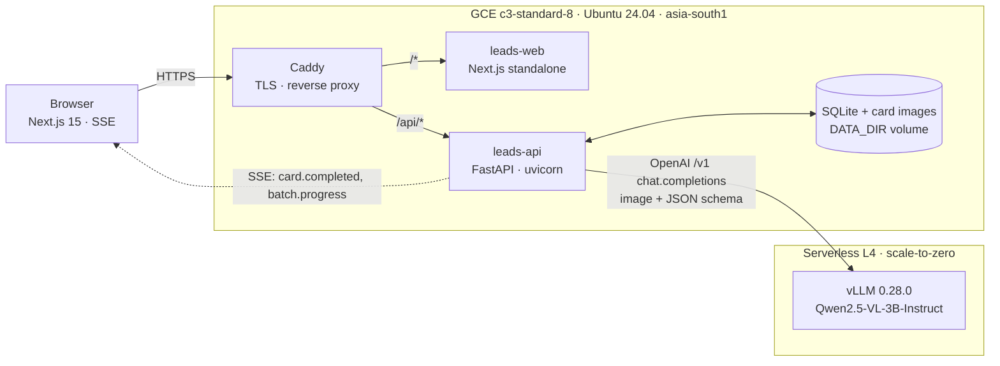
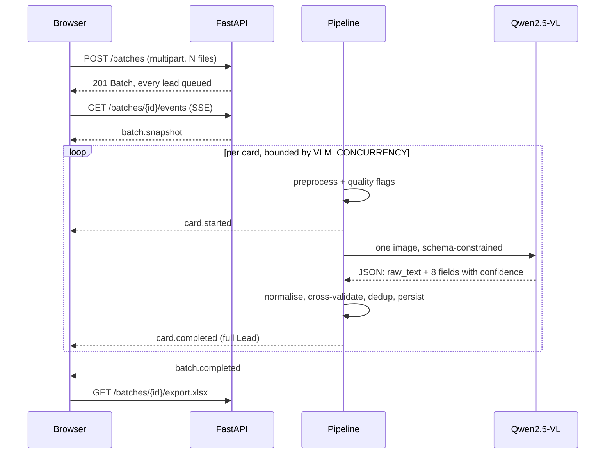

# LeadForge

### **Live: https://leads-34-47-153-95.nip.io**

**Business cards in. Pipeline-ready leads out.** Bulk-upload up to 25 business-card photos,
a self-hosted Qwen2.5-VL vision-language model reads each one, and structured leads stream
back with per-field confidence, a review queue, duplicate flagging and a one-click Excel
export.

```bash
git clone <this repo> && cd assignment1
docker compose up --build      # -> http://localhost:3000, no GPU, no API key, no .env
```

> **Cloud provider: the brief says AWS, this runs on GCP Compute Engine.**
> That is the account with billing, quota and an existing footprint available to the author,
> and the choice is stated here rather than buried. Nothing in the design is GCP-specific:
> the runtime is a `docker-compose.yml` and a `Caddyfile` on one Linux box. The AWS port is a
> rewrite of the provisioning script, not of the application — **EC2 `m7i.2xlarge` + an
> Elastic IP + a security group open on 80/443, running the identical Compose stack with
> `bootstrap.sh` as user-data**; or **ECS Fargate behind an ALB with ACM TLS** for the
> stateless tier, at which point the ALB's listener rules replace Caddy's path routing.
> Full mapping, resource by resource, in [`docs/01-architecture.md`](docs/01-architecture.md#aws-equivalents)
> and [`../infra/README.md`](../infra/README.md#note-on-cloud-provider-this-is-gcp-the-brief-says-aws).

---

## What it does

| | |
|---|---|
| **Bulk ingest** | Drag, drop or paste up to 25 cards (JPEG, PNG, WebP, HEIC/HEIF, PDF — 12 MB each). EXIF auto-orient, HEIC and first-page PDF decode, downscale to 1280 px, JPEG q=88. |
| **Extract** | One self-hosted `Qwen/Qwen2.5-VL-3B-Instruct` call per card, JSON-schema-constrained so the model *cannot* return unparseable output. Eight fields plus a faithful `raw_text` transcription. |
| **Validate** | Deterministic normalisation (phone → E.164, email validation, name splitting), then cross-field validation that *adjusts* confidence, then a `needs_review` queue instead of a hard accept/reject. |
| **Review** | Live SSE progress, side-by-side card image and fields, inline correction — an edited field pins to confidence 1.0 and re-scores the record. |
| **Export** | A styled three-sheet `.xlsx` (Leads / Summary / Raw) or CSV, with duplicates grouped and low-confidence rows optional. |

---

## Requirements traceability

Everything the brief asked for, where it lives, and how to check it in about a minute each.

| # | Requirement | Where it is implemented | How to verify |
|---|---|---|---|
| 1 | **Deploy a Qwen VLM on a free-tier/equivalent server** | [`infra/modal/qwen_vlm.py`](infra/modal/) — vLLM 0.28.0 serving `Qwen/Qwen2.5-VL-3B-Instruct` (revision pinned `66285546…`) on a serverless **L4 GPU**, OpenAI-compatible `/v1`, bearer-auth'd, **scaled to zero when idle so it costs nothing at rest**. | `GET /api/v1/health` on the live URL reports `provider`, `model` and warmth. Deployment recipe and auth hardening: [`infra/modal/README.md`](infra/modal/README.md), rationale: [ADR-0002](docs/adr/ADR-0002-self-hosted-vllm-on-serverless-gpu.md). |
| 2 | **Bulk upload of business-card images** | `POST /api/v1/batches`, multipart, repeatable `files` — [`backend/app/routes/batches.py`](backend/app/routes/batches.py). Frontend dropzone accepts drag, file picker, clipboard paste and a bundled sample corpus. | Open the live URL, hit **Load sample cards**, then **Extract**. Or `curl -F "files=@samples/cards/card_01_left_align_clean.png" …` — see [`docs/04-api.md`](docs/04-api.md). |
| 3 | **Extract first name, last name, position, company, location, phone, email** | [`backend/app/vlm/prompt.py`](backend/app/vlm/prompt.py) (schema) → [`backend/app/extract/`](backend/app/extract/) (normalise, cross-validate, score). Website is extracted too, as a bonus field. | `GET /api/v1/batches/{id}` returns every field with its own confidence. Scored against ground truth by [`samples/evaluate.py`](samples/README.md#scoring-an-extraction-run) — **88 % of fields correct** on non-degraded cards. |
| 4 | **Display the leads in the app** | Next.js 15 App Router. Live card grid + table view + review drawer — [`frontend/src/components/batch/`](frontend/src/components/batch/), streamed over SSE. | Upload a batch; rows appear card by card as the model finishes each one. [`docs/05-frontend.md`](docs/05-frontend.md). |
| 5 | **Download as Excel** | `GET /api/v1/batches/{id}/export.xlsx` — three styled sheets built with openpyxl in [`backend/app/export.py`](backend/app/export.py). CSV fallback on the same route family. | Click **Export** in the UI, or `curl -O -J "…/export.xlsx"`. Verified by a test that reopens the produced workbook with openpyxl. |
| 6 | **Deploy publicly with a URL** | **https://leads-34-47-153-95.nip.io** — one GCE `c3-standard-8`, Caddy terminating Let's Encrypt TLS and reverse-proxying `/api/*` to the API. Provision and deploy scripts: [`../infra/`](../infra/README.md). | `curl -sSI https://leads-34-47-153-95.nip.io` → `HTTP/2 200`. |
| — | **README with setup + deploy instructions** | This file ([Quickstart](#quickstart)), plus [`../infra/README.md`](../infra/README.md) for the public deployment runbook. | |
| — | **Architecture description** | [Architecture in 60 seconds](#architecture-in-60-seconds) below, in depth in [`docs/01-architecture.md`](docs/01-architecture.md). | |
| — | **Major technical decisions** | Six ADRs, one per genuinely contested fork in the road: [`docs/adr/`](docs/adr/). | |
| — | **Libraries, frameworks, pretrained models** | [Components](#components) below. | |
| — | **Known limitations** | [`docs/07-limitations.md`](docs/07-limitations.md) — written to be uncomfortable, not to be reassuring. | |

---

## Architecture in 60 seconds

Three tiers, each independently replaceable. A Next.js UI, a FastAPI service that owns
everything deterministic, and a GPU that is only ever asked to *read pixels*.



The request lifecycle for one batch:



**The one idea worth taking away:** a VLM is an excellent *reader* and a poor *validator*. So
the model is asked only to transcribe, and every judgement about whether a value is
trustworthy is made by deterministic code afterwards — phone parsing, email validation,
cross-field agreement, duplicate detection. That layering is the subject of
[`docs/03-extraction-pipeline.md`](docs/03-extraction-pipeline.md), the doc to read if you
only read one.

---

## Quickstart

### Run the whole product offline, with no GPU and no credentials

```bash
cd assignment1
docker compose up --build
```

Then open **http://localhost:3000**. Click *Load sample cards* → *Extract*.

With no `.env` present, the API starts on `VLM_PROVIDER=stub`: a deterministic fake
extraction derived from each upload's filename. Every part of the product is exercised —
upload validation, streaming progress, per-field confidence, the review queue, duplicate
flagging, the styled workbook — with no GPU, no network egress and no API key. Filename
keywords steer the outcome so the failure paths are reachable too: `…fail…` fails a card,
`…blur…` drives it into the review queue, `…dup…` collides with another card.

The API is on **http://localhost:8000**, with interactive OpenAPI docs at
[`/docs`](http://localhost:8000/docs). Ports and everything else are overridable — copy
[`.env.example`](.env.example) to `.env`.

### Point it at the real model

```bash
cp .env.example .env
# then set, in .env:
#   VLM_PROVIDER=modal
#   VLM_BASE_URL=https://<your-modal-workspace>--ak-project-vlm-serve.modal.run/v1
#   VLM_API_KEY=<bearer key from the ak-project-vlm-auth Modal secret>
docker compose up --build
```

Standing that endpoint up from scratch is three commands and is documented in
[`infra/modal/README.md`](infra/modal/README.md). **The first request after an idle period
pays a ~210 s cold start** while the scale-to-zero GPU boots — that is the deliberate cost
of a GPU that bills nothing at rest. The UI shows a *Cold* pill and offers to warm the
endpoint first; `POST /api/v1/vlm/warmup` does it from the API.

### Make targets

| | |
|---|---|
| `make up` | build + start the stack, print the URLs |
| `make down` | stop it (`ARGS=-v` also drops the data volume) |
| `make dev` | both dev servers on the host with hot reload, no Docker |
| `make test` | 188 backend tests (offline) + frontend type check |
| `make lint` | `ruff` over the backend, `eslint` over the frontend |
| `make e2e` | Playwright smoke test (run `make down` first — it needs port 3000) |
| `make bench` | throughput of the non-model pipeline |
| `make build` | build both images without starting them |

> `assignment1/docker-compose.yml` is the **developer** stack: it builds both images from
> source and publishes them on localhost. The **deployment** stack is
> [`../infra/docker-compose.yml`](../infra/docker-compose.yml), which puts both assignments
> behind one Caddy instance with Let's Encrypt TLS and only consumes pre-built images. The
> two never overlap.

---

## Tests

```bash
make test     # 188 backend tests + tsc --noEmit
make lint     # ruff + eslint
make e2e      # Playwright smoke: upload -> stream -> retry -> edit -> export
```

Everything runs offline against the stub provider. Current state: **188 backend tests
passing, `ruff` clean, `next build` clean with zero type or lint errors, Playwright smoke
passing.**

The backend suite asserts behaviour, not coverage: contract-shape assertions on every
response, the full batch lifecycle, SSE ordering with late and concurrent subscribers,
table-driven phone/email/name normalisation, duplicate detection, the confidence
cross-validation rules, the produced workbook reopened with openpyxl, every upload rejection
path, and VLM retry/repair behaviour against a scripted failing server.

Extraction *quality* is measured separately, against ground truth:

```bash
# upload samples/cards/ (20 cards), then:
curl -s "http://localhost:8000/api/v1/batches/$BATCH/export.csv" -o batch.csv
python samples/evaluate.py batch.csv --errors
```

Point the stack at the real model first — scoring a `stub` batch correctly reports ~0 %,
since the stub invents people rather than reading the cards. `python samples/evaluate.py
--self-test` proves the harness itself with no batch at all.

---

## Configuration

Every variable has a working default; the stack runs with no `.env` at all. Full annotated
list in [`.env.example`](.env.example).

| Variable | Default | Purpose |
|---|---|---|
| `VLM_PROVIDER` | `stub` | `stub` \| `modal` \| `openai_compatible`. `stub` is offline and credential-free. |
| `VLM_BASE_URL` | — | OpenAI-compatible `/v1` base URL. Required unless `stub`. |
| `VLM_MODEL` | `Qwen/Qwen2.5-VL-3B-Instruct` | Must match the endpoint's `--served-model-name`. |
| `VLM_API_KEY` | — | Bearer token for the endpoint. Never committed. |
| `VLM_CONCURRENCY` | `6` | In-flight requests; an `asyncio.Semaphore` held across preprocess + inference. |
| `VLM_TIMEOUT_S` | `420` | Per-request timeout. **Must be ≥ 300** — a cold boot is 187–237 s. The compose default overrides the app default, so both ship 420. |
| `VLM_COLD_TIMEOUT_S` | `360` | Used until the first success: worst-case boot plus one inference. |
| `VLM_MAX_RETRIES` / `VLM_RETRY_BASE_S` | `3` / `1.5` | Retries on 5xx/429/timeout, exponential backoff with full jitter. |
| `VLM_TEMPERATURE` / `VLM_MAX_TOKENS` | `0.0` / `1024` | Explicit `0.0`; the model's own `generation_config.json` otherwise applies `repetition_penalty=1.05`. `max_model_len` is 4096 and the image is ~1280 tokens. |
| `CONFIDENCE_THRESHOLD` | `0.65` | Below this a lead becomes `needs_review` rather than `completed`. |
| `DUPLICATE_FUZZY_THRESHOLD` | `90` | rapidfuzz token-set ratio over `first + last + company`. |
| `MAX_FILES_PER_BATCH` / `MAX_FILE_MB` | `25` / `12` | Contract limits; enforced before the body is read. |
| `DEFAULT_PHONE_REGION` | `US` | Fallback when a number has no country code and the card's address gives no hint. |
| `DATA_DIR` | `/data` | SQLite database and stored card images. |
| `CORS_ORIGINS` | `*` | Comma-separated. The dev stack is cross-origin (`:3000` → `:8000`); production is same-origin behind Caddy. |
| `LOG_LEVEL` | `INFO` | Structured JSON to stdout. |
| `NEXT_PUBLIC_API_BASE` | `http://localhost:8000/api/v1` | Browser-visible API base, inlined at build time. `/api/v1` in production. |
| `NEXT_PUBLIC_MOCK` | `0` | `1` runs the frontend against its own in-process mock, with no API container at all. |

**No secret appears anywhere in this repository.** `.env.example` names variables and never
holds values; the live bearer key lives in a Modal Secret and in the deployment host's
`.env`, neither of which is in version control.

---

## Measured performance

Numbers, not estimates. Methodology precise enough to re-run is in
[`docs/06-performance.md`](docs/06-performance.md).

**Model serving** — L4 GPU, fixed benchmark fixtures, client in `ap-south`, so public
internet RTT is included. Container-to-container variance on this GPU class is ~25–30 %, so
every figure is a range over multiple runs rather than the best one.

| | |
|---|---|
| Cold start, scaled-to-zero GPU | **187–237 s**, median ~210 s (258–300 s on a first-ever boot with empty caches) |
| Warm, single card | **6.2–11.4 s** |
| Warm, 6-way concurrency | **0.50–0.67 img/s**, 100–133 output tok/s |
| Output per card | ~199 tokens — the schema includes a full `raw_text` transcription |
| **25-card batch, warm** | **37–50 s** |

**The rest of the pipeline** — `make bench`, against the stub provider, so the number
isolates our own overhead from inference (Apple M-series, 10 cores):

| | |
|---|---|
| 25 cards, upload → `completed` | 0.6–0.8 s (32–41 cards/s) |
| Mean per-card pipeline work | 195–275 ms (decode, quality metrics, resample, JPEG, normalise, dedup, persist) |
| `.xlsx` export, 25 rows, 3 sheets | 25–35 ms |

**Accuracy** — cards from the bundled ground-truth corpus in [`samples/`](samples/README.md)
run through the **live** model and scored field by field by `samples/evaluate.py`. Five cards,
forty fields: four non-degraded plus one deliberately degraded duplicate.

| | non-degraded cards | including the degraded card |
|---|---|---|
| Fields correct | **28/32 (88 %)** | 30/40 (75 %) |

The corpus itself holds 20 cards with exact ground truth; five were scored against the live
GPU. That sample is thin, and it is [named as a limitation](docs/07-limitations.md).

Name, company, phone, email and website were correct on **every** non-degraded card. The
residual location mismatches differ from ground truth only by a retained postcode — a
deliberate choice not to over-fit the metric, since a postcode is not wrong, just more than
was asked for.

**Cost.** The VM is $0.4408/hr ≈ **$10.58/day**. The GPU costs **nothing at idle** because it
scales to zero; a warm 25-card batch is ~$0.011 of GPU time and a cold one ~$0.12. Breakdown:
[`docs/08-security-and-cost.md`](docs/08-security-and-cost.md), [`../infra/COST.md`](../infra/COST.md).

---

## Components

**Pretrained model**

| | |
|---|---|
| `Qwen/Qwen2.5-VL-3B-Instruct` | Apache-2.0. Revision pinned `66285546d2b821cf421d4f5eb2576359d3770cd3` so an upstream re-upload can never silently change what the endpoint serves. 3B chosen over 7B/72B deliberately — see [ADR-0001](docs/adr/ADR-0001-qwen2.5-vl-3b-over-larger-variants.md). |

**Serving**

| | |
|---|---|
| vLLM 0.28.0 | V1 engine, xgrammar structured outputs, `--enforce-eager`, 1280-visual-token cap per image. |
| Modal | Serverless GPU host: one L4, `min_containers=0`, `scaledown_window=900 s`. |

**Backend** — Python 3.11

| | |
|---|---|
| FastAPI + uvicorn | HTTP, SSE, OpenAPI |
| pydantic v2 | Contract models, validated at the boundary |
| openai (async client) | OpenAI-compatible transport to vLLM |
| Pillow + pillow-heif + pypdfium2 | Decode, EXIF orient, HEIC, first-page PDF, downscale, quality metrics |
| phonenumbers | E.164 normalisation and region inference |
| email-validator | RFC-correct syntax validation |
| rapidfuzz | Token-set ratio for duplicates, Levenshtein for corroborated OCR repair |
| openpyxl | The styled three-sheet workbook |
| sqlite3 (stdlib) | Persistence, WAL mode — [ADR-0006](docs/adr/ADR-0006-sqlite-and-local-disk-over-postgres.md) |
| pytest + ruff | 220 tests, lint |

**Frontend** — Node 20, TypeScript strict

| | |
|---|---|
| Next.js 15 (App Router, `output: 'standalone'`) | Server components by default |
| Tailwind CSS v4 | CSS-first `@theme`, no config bloat |
| Framer Motion 11 | All motion; continuous values driven through motion values, not re-renders |
| @tanstack/react-table | The table view |
| lucide-react, sonner, geist | Icons, toasts, typeface |
| Playwright | Smoke test |

**Infrastructure**

| | |
|---|---|
| Docker + Compose | Both stacks |
| Caddy 2 | TLS (Let's Encrypt), reverse proxy, SSE-safe `flush_interval -1` |
| GCE `c3-standard-8` | Intel Xeon Platinum 8481C @ 2.70 GHz, 8 vCPU / 4 physical cores, 31 GiB usable, Ubuntu 24.04, `asia-south1-b` |
| nip.io | Public DNS for a bare IP, no domain registration |

---

## Repository layout

```
assignment1/
├── README.md               ← you are here
├── docker-compose.yml      standalone developer stack (builds from source)
├── Makefile                up / down / dev / test / lint / build / e2e / bench
├── .env.example            every variable, annotated; no values
├── backend/                FastAPI service
│   └── app/
│       ├── main.py             app factory, middleware, lifespan, error shape
│       ├── models.py           contract models + Settings
│       ├── store.py            SQLite (WAL) + card images on disk
│       ├── pipeline.py         batch fan-out, bounded concurrency, SSE event bus
│       ├── export.py           styled .xlsx and .csv
│       ├── routes/             batches · leads · events · health · deps
│       ├── extract/            preprocess · normalise · confidence · dedup
│       └── vlm/                client · prompt · parse
├── frontend/               Next.js 15 UI (+ an in-process mock backend)
├── infra/modal/            the GPU deployment: vLLM on a serverless L4
├── samples/                20 synthetic cards, exact ground truth, and a scorer
└── docs/                   architecture, deep dives, ADRs
```

---

## Documentation

Start at [`docs/README.md`](docs/README.md) for a 60-second tour.

| | |
|---|---|
| [01 — Architecture](docs/01-architecture.md) | System diagram, request lifecycle, data flow, deployment topology, AWS equivalents |
| [02 — Model serving](docs/02-model-serving.md) | vLLM on a scale-to-zero L4: tuning, auth, cold-start anatomy, cost model |
| [03 — Extraction pipeline](docs/03-extraction-pipeline.md) | **The differentiator.** Schema-constrained decoding → normalisation → cross-field validation → review queue → dedup, and why each layer exists |
| [04 — API](docs/04-api.md) | Every endpoint with a real `curl` and a real response |
| [05 — Frontend](docs/05-frontend.md) | UI architecture, the SSE hook, and the motion design rationale |
| [06 — Performance](docs/06-performance.md) | Benchmark methodology, measured numbers, test environment |
| [07 — Limitations](docs/07-limitations.md) | Honest failure modes and what two more weeks would buy |
| [08 — Security & cost](docs/08-security-and-cost.md) | Threat model of a public demo, abuse limits, running cost |
| [ADR-0001 … 0006](docs/adr/) | One per genuinely contested decision |

## Known limitations, in brief

The full, uncomfortable list is [`docs/07-limitations.md`](docs/07-limitations.md). The four
that would matter most to a user:

1. **~210 s cold start.** The first request after four idle minutes waits for a GPU to boot.
   Scale-to-zero buys a $0 idle bill and charges for it exactly here.
2. **Family-name-first ordering is mis-split.** `Tan Wei Ming` becomes first name
   `Tan Wei Ming`, last name `Ming`. The email local part usually carries the evidence to fix
   it, and the cross-validation step is the right place to use that signal — it does not yet.
3. **A degraded card can be confidently wrong.** One blurred duplicate scored **0.88** while
   hallucinating company, phone and domain. The per-field scores stay high because the model
   is confidently misreading; a flat per-flag penalty does not discount that enough. This is
   the confidence model's real weakness.
4. **No authentication and no rate limiting on the public demo**, single-replica SQLite with
   no HA, and no PII retention policy on uploaded cards.

## Licence and provenance

Every card in `samples/` is rendered by `samples/generate_cards.py` in this repository. No
scraped data, no photograph of a real card, no real person or company: domains use the
IANA-reserved `.example` TLD and phone numbers come from ranges regulators reserve for
fiction. The model is Apache-2.0.
