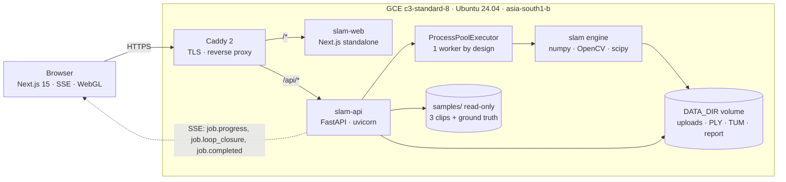
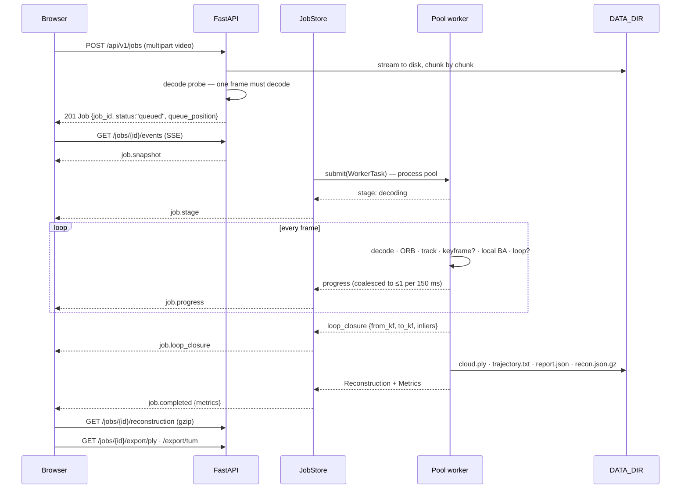
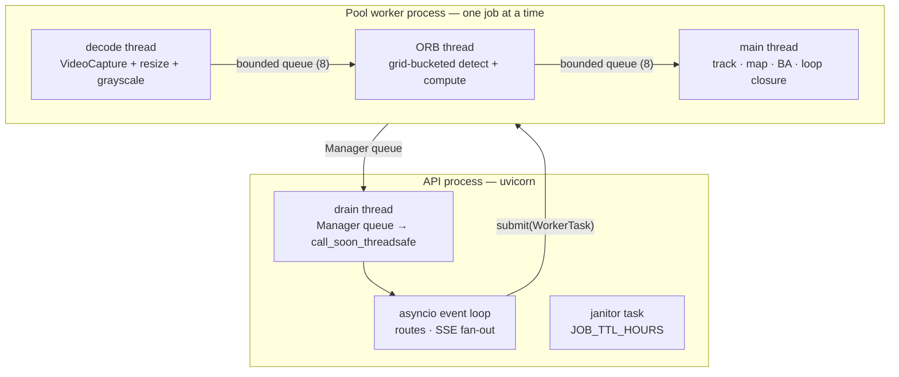

# 01 — Architecture

Three tiers on one box, each independently replaceable: a Next.js UI, a FastAPI service that
owns admission, queueing, artefacts and the event stream, and a pure-Python SLAM engine that
is a plain library with no knowledge of HTTP.

The engine is a `pip`-installable package (`assignment2/slam`) with three runtime
dependencies — `numpy`, `opencv-python-headless`, `scipy`. That is the whole supply chain.
There is no GPU, no CUDA, no ROS, no native extension to compile, and no pretrained model to
download.

---

## System



Caddy terminates Let's Encrypt TLS and path-routes `/api/*` to the API and everything else
to the UI, so the browser sees one origin and `NEXT_PUBLIC_API_BASE` stays the relative
`/api/v1`. It sets `flush_interval -1` on the API route, without which the SSE stream would
be buffered and progress would arrive in one lump at the end.

---

## Job lifecycle



Three properties of that sequence are load-bearing.

**The decode probe happens before a job id exists.** An undecodable upload is rejected with
`UNDECODABLE_VIDEO` and leaves nothing on disk — no orphan directory, no job row, no artefact
to reap. It is also *outside* the `wall_ms` measurement, which is stated explicitly in
[06 — Performance](06-performance.md) rather than left for a reviewer to wonder about.

**Progress crosses a process boundary, not a thread boundary.** The worker writes events to a
`multiprocessing.Manager` queue; a daemon thread in the API process drains it and hands each
event to the event loop with `call_soon_threadsafe`. Nothing in the hot path touches the
loop directly, and the loop never waits on the worker.

**`job.progress` is coalesced.** At 60–110 frames per second the engine would emit an event
every 9–16 ms. The store holds the newest payload and flushes at most one per 150 ms, so the
stream can never become the bottleneck it is supposed to be reporting on.

---

## Process and thread model



Why this shape:

- **SLAM runs in a child process, never a thread.** It is CPU-bound Python; in-process it
  would hold the GIL and starve the event loop, and the SSE stream would stutter exactly
  when it is most interesting.
- **Decode and ORB do get threads.** OpenCV releases the GIL inside `VideoCapture.read`,
  `resize` and `ORB`, so those stages genuinely overlap with tracking. The measured effect is
  visible in the benchmark: on the desk clip `decode_ms` is 103 ms and `feature_ms` is
  2096 ms against a 4323 ms wall, so the ORB thread is ~48 % busy and almost entirely hidden.
- **Bundle adjustment does not get a thread.** Its inner loop is Python plus small NumPy
  arrays — GIL-bound. A worker thread would add lock traffic and buy nothing.
- **Queues are bounded at 8 frames.** Unbounded, the decoder would race ahead of tracking and
  hold the whole clip in RAM.

---

## Modules

### SLAM engine — `assignment2/slam`

| module | responsibility |
|---|---|
| `config.py` | `SlamConfig`: every tunable knob, with the cost of moving it in the comment |
| `features.py` | grid-bucketed ORB, `cv2.batchDistance` ratio matching, epipolar and proximity masks |
| `geometry.py` | SO(3)/SE(3)/Sim(3) exp, log, adjoint; triangulation; parallax; Umeyama; Sim(3) RANSAC |
| `tracking.py` | focal self-calibration, homography-vs-essential initialisation, frame-to-map tracking, relocalisation |
| `mapping.py` | struct-of-arrays map, keyframes, covisibility, culling, local/global/structure-only bundle adjustment |
| `loop.py` | vocabulary, inverted index, candidate filtering, Sim(3) verification, pose-graph optimisation |
| `pipeline.py` | the threaded run loop, keyframe policy, new-point triangulation, metrics |
| `results.py` | `Reconstruction`, `Metrics`, `DriftMetrics`, `PoseRecord` |
| `io.py` | binary PLY, TUM trajectory |
| `vocab.npz` | 1024 binary visual words + tf-idf weights, built offline by `bench/build_vocab.py` |

### API — `assignment2/backend/app`

The refactor that split `main.py` into routers landed; this is what is on disk.

| module | responsibility |
|---|---|
| `main.py` | app factory only: lifespan, CORS, request-id middleware, JSON logging, the contract's error shape |
| `models.py` | pydantic v2 models mirroring the contract, `extra="forbid"` |
| `routes/__init__.py` | router assembly; the include order *is* the FastAPI match order |
| `routes/jobs.py` | `POST /jobs`, `POST /jobs/from-sample/{id}`, `GET /jobs/{id}` — upload validation, admission |
| `routes/events.py` | `GET /jobs/{id}/events` — SSE, 15 s pings, late-subscriber replay |
| `routes/artifacts.py` | `/reconstruction`, `/export/ply`, `/export/tum`, `/export/report.json`, `/preview/{i}` |
| `routes/samples.py` | `GET /samples`, `GET /samples/{id}/file` |
| `routes/health.py` | `GET /health` |
| `routes/deps.py` | shared route dependencies, `ApiError`, the `/api/v1` prefix and version constants |
| `jobs/settings.py` | `Settings.from_env()` — every knob is an env var |
| `jobs/store.py` | `JobStore`: job records, the process pool, the SSE event bus, the disk janitor |
| `runner/adapter.py` | the boundary to the `slam` package; the worker entrypoint; artefact names |
| `runner/stub.py` | the synthetic backend — no engine required |
| `exports.py` | PLY / TUM / `report.json`, the web point budget, frame previews |

> **Where the code and the plan differ.** An earlier layout sketch listed
> `jobs/{settings,store,pool,events,janitor}.py`. On disk `jobs/` is **two files**. The
> process pool, the SSE event bus and the disk janitor are all methods of the single
> `JobStore` object in `jobs/store.py` (423 lines): they share nine mutable private tables —
> the job records, the subscriber sets, the coalesced-progress buffer, the terminal-event
> replay cache, the pending flush handles — and splitting them across modules would have
> required either mixins or cross-module access to those privates. `RULES.md` asks for "a
> 200-line file that is obviously correct over six 40-line files with an abstraction layer
> between them"; this is the same trade one size up. `routes/` and `runner/` *did* split,
> because those modules genuinely share nothing but a settings object.

### Frontend — `assignment2/frontend/src`

| path | responsibility |
|---|---|
| `app/page.tsx` | hero, sample picker, upload dropzone |
| `app/j/[jobId]/page.tsx` | live run and results |
| `lib/api.ts` | the only place that talks to the API; maps contract error codes to human copy |
| `lib/recon.ts` | `Reconstruction` JSON → GPU-ready typed arrays, OpenCV → three.js basis change |
| `lib/use-event-source.ts` | one SSE hook: exponential backoff, polling fallback after three failures |
| `lib/mock.ts` | the in-browser mock backend, shaped exactly like the contract |
| `components/viewer/` | `<Canvas>`, point cloud, trajectory, camera rig, overlay |

Details in [05 — Frontend](05-frontend.md).

---

## Data flow and storage

Everything a job produces lives in one directory under `DATA_DIR`:

```
$DATA_DIR/<job_id>/
├── source.mp4              the upload, or a copy of the sample clip
├── recon.json              full reconstruction, uncapped
├── recon.web.json.gz       the ≤60 000-point browser payload, pre-gzipped at write time
├── cloud.ply               binary little-endian PLY, full cloud
├── trajectory.txt          TUM format: timestamp tx ty tz qx qy qz qw
└── report.json             metrics + the full SlamConfig + the timing definitions
```

There is no database. Job *state* is an in-process dict; job *artefacts* are files. That is a
deliberate scope decision and it has a real cost, named in
[07 — Limitations](07-limitations.md): an API restart loses the job table, and the artefacts
on disk survive but are no longer addressable.

In the developer stack `DATA_DIR` is the `driftless-data` **named volume**, not a `./data`
bind mount. The image runs as the unprivileged uid 10001 it creates at build time, and a
named volume inherits that ownership from the image on every platform; a host directory does
not — on Linux it takes the host's ownership and the container cannot write to it, and
Docker Desktop refuses outright to share host paths that are not on its file-sharing list.
`docker compose cp api:/data/<job_id>/cloud.ply .` pulls an artefact out; the compose file
documents the bind-mount swap for anyone who wants the whole directory on the host.

The web payload is gzipped **once, at write time**, and served pre-compressed. There is no
`GZipMiddleware`, on purpose: blanket middleware would buffer whole sample videos into memory
and burn CPU re-compressing already-compressed JPEG previews.

The janitor deletes job directories older than `JOB_TTL_HOURS` (default 24). It is time-based
only — there is no disk-pressure trigger.

---

## Coordinate conventions

One source of confusion in every SLAM codebase, so it is pinned down in the contract and
enforced at the boundary.

| | |
|---|---|
| Camera axes | OpenCV: **+Z forward**, **+X right**, **+Y down** |
| World frame | The first keyframe's camera frame |
| Internal storage | `T_cw` — camera-from-world. `x_c = R x_w + t` |
| API output | `T_wc` — world-from-camera, because that is what a renderer wants. `position` is the camera centre; `quaternion` is `[qw, qx, qy, qz]` |
| TUM export | Reordered to the scalar-last `tx ty tz qx qy qz qw` that format requires |
| Units | **Up to scale.** The initial two-view baseline is fixed to 1.0 |

The frontend applies the OpenCV → three.js basis change once, in `lib/recon.ts`, and every
component downstream works in three.js coordinates.

---

## Deployment topology

One Compute Engine VM runs both assignments behind a single Caddy instance. The full runbook
— provision, deploy, SSH, logs, teardown — is [`../../infra/README.md`](../../infra/README.md).

| | |
|---|---|
| Instance | `c3-standard-8`, `asia-south1-b` |
| CPU | Intel Xeon Platinum 8481C @ 2.70 GHz (Sapphire Rapids) — **8 vCPU but only 4 physical cores** (2 threads each) |
| RAM / disk | 32 GiB (31 GiB usable) / 100 GiB Balanced PD |
| OS | Ubuntu 24.04 LTS |
| Public address | `34.47.153.95`, via a regional static IP |
| Hostname | `slam-34-47-153-95.nip.io` — [nip.io](https://nip.io) resolves a bare IP, no domain registration |
| TLS | Let's Encrypt, automatic, certificates on a bind mount so they survive container recreation |
| SSH | Port 22 is **not** open to the internet; access is via IAP tunnel only |

Images are built **on the VM**, not pushed to a registry. That removes registry auth and
lifecycle management entirely and avoids the arm64/amd64 mismatch an Apple Silicon laptop
would otherwise produce. The trade-off — no image history to roll back to — is acceptable for
a demo host and is called out in the infra runbook.

The 4-physical-core detail matters for requirement #6 and is not glossed over: the benchmark
machine is a 10-core Apple M4 and the deployment host is a 4-core Xeon presenting 8 threads.
[06 — Performance](06-performance.md) keeps those two columns strictly apart.

---

## AWS equivalents

The brief specified AWS. This is deployed on **GCP Compute Engine**, because that is the
account with billing, quota and an existing footprint available to the author. The choice is
stated here and in the project README rather than buried.

Nothing in the design is GCP-specific. The entire runtime is a `docker-compose.yml` and a
`Caddyfile` on one Linux box — deliberately the most portable shape this could take. The AWS
port is a rewrite of `provision.sh`, not of the application.

| This deployment (GCP) | AWS equivalent |
|---|---|
| `c3-standard-8` — 8 vCPU / 32 GiB, Xeon Platinum 8481C (Sapphire Rapids) | **`c7i.2xlarge`** — 8 vCPU / 16 GiB, Xeon Platinum 8488C, same Sapphire Rapids generation. For a like-for-like 32 GiB, `m7i.2xlarge` is the exact match |
| Static regional external IP | **Elastic IP**, associated with the instance |
| Firewall rule tcp:80,443 from `0.0.0.0/0`, scoped by network tag | **Security group** inbound rules on 80/443. Network tags → SG membership |
| Firewall rule tcp:22 from the IAP range only | **No inbound 22 at all**; **SSM Session Manager** (`aws ssm start-session --target i-…`). Same posture: no public SSH port |
| Dedicated VPC + subnet | **VPC** + public subnet + internet gateway + route table |
| Instance `startup-script` metadata → `bootstrap.sh` | **EC2 user-data**, byte-for-byte the same script |
| 100 GiB `pd-balanced` boot disk | **100 GiB `gp3` EBS** volume |
| `gcloud compute ssh --tunnel-through-iap` | `aws ssm start-session` |
| Ubuntu 24.04 LTS image family | Canonical Ubuntu 24.04 LTS AMI |

`docker-compose.yml`, `Caddyfile`, `bootstrap.sh` and the systemd unit transfer **unchanged**.

**Why not Fargate for this one.** The two web tiers would move to ECS Fargate behind an ALB
with ACM TLS without complaint, and the ALB's listener rules would replace Caddy's path
routing outright. `slam-api` is the exception and is the reason this is one VM today:
reconstruction is a long-running, CPU-bound, stateful job that writes intermediate artefacts
to `DATA_DIR` and streams SSE for the duration. On Fargate that needs an 8 vCPU / 32 GiB task
definition, an EFS mount for `DATA_DIR`, and an ALB idle timeout raised well past the 60 s
default. It works; it is strictly more moving parts than a single box for a demo with one
concurrent user. Honest recommendation: EC2 now, Fargate for the web tier when traffic
justifies splitting it.

---

## Two Compose files, no overlap

| file | role |
|---|---|
| [`../docker-compose.yml`](../docker-compose.yml) | **Developer stack.** Builds both images from source, publishes them on `localhost:3000` / `localhost:8000`, keeps artefacts in the `driftless-data` named volume and mounts `./samples:/samples:ro`. This is what `docker compose up --build` runs |
| [`../../infra/docker-compose.yml`](../../infra/docker-compose.yml) | **Deployment stack.** Puts *both* assignments behind one Caddy with Let's Encrypt TLS, consumes pre-built `ak-project/*` images, and never defines how they are built |

The build context of the API image is `assignment2/`, **not** `assignment2/backend/`, because
the image runs `pip install ./slam` on the sibling engine. `assignment2/.dockerignore` keeps
that context at ~3 MB by excluding the frontend, `node_modules` and the bench results.
