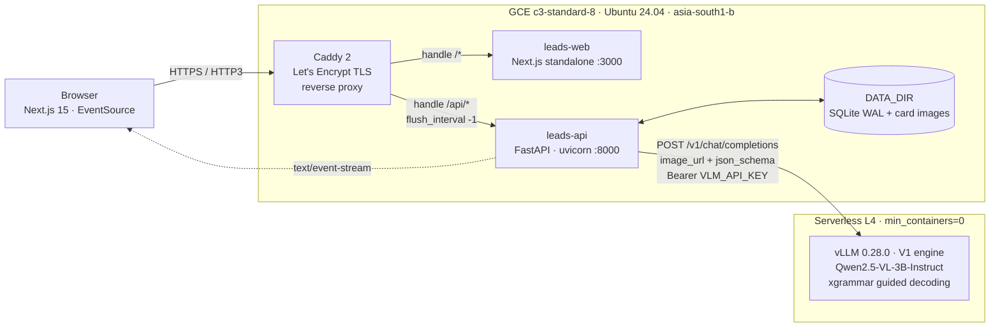
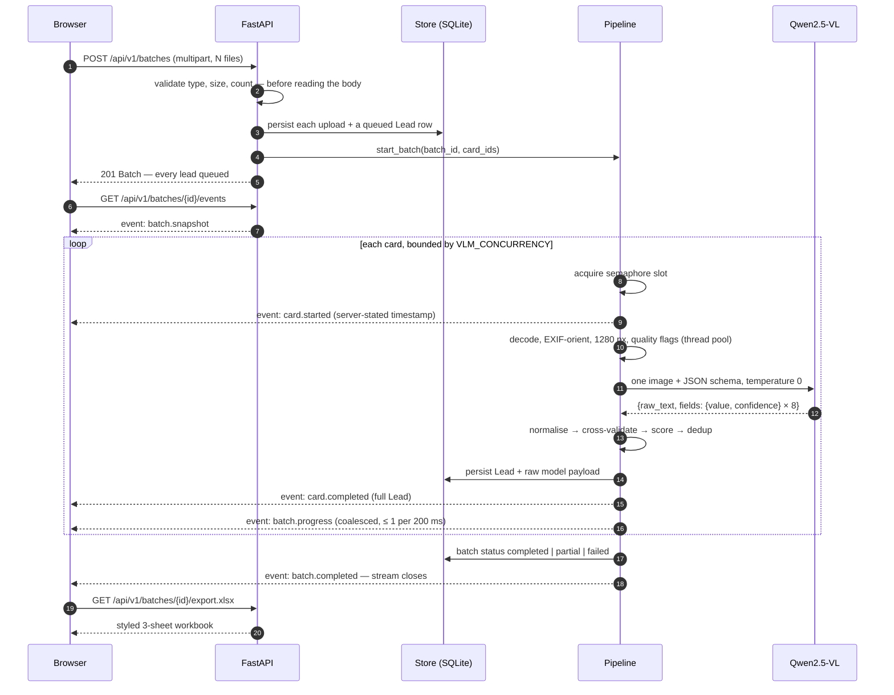
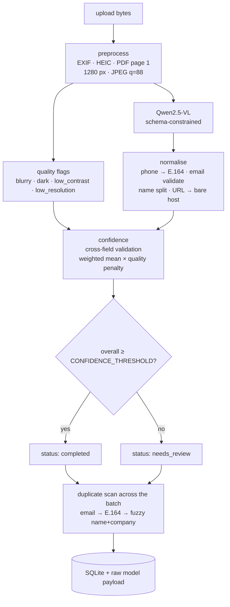
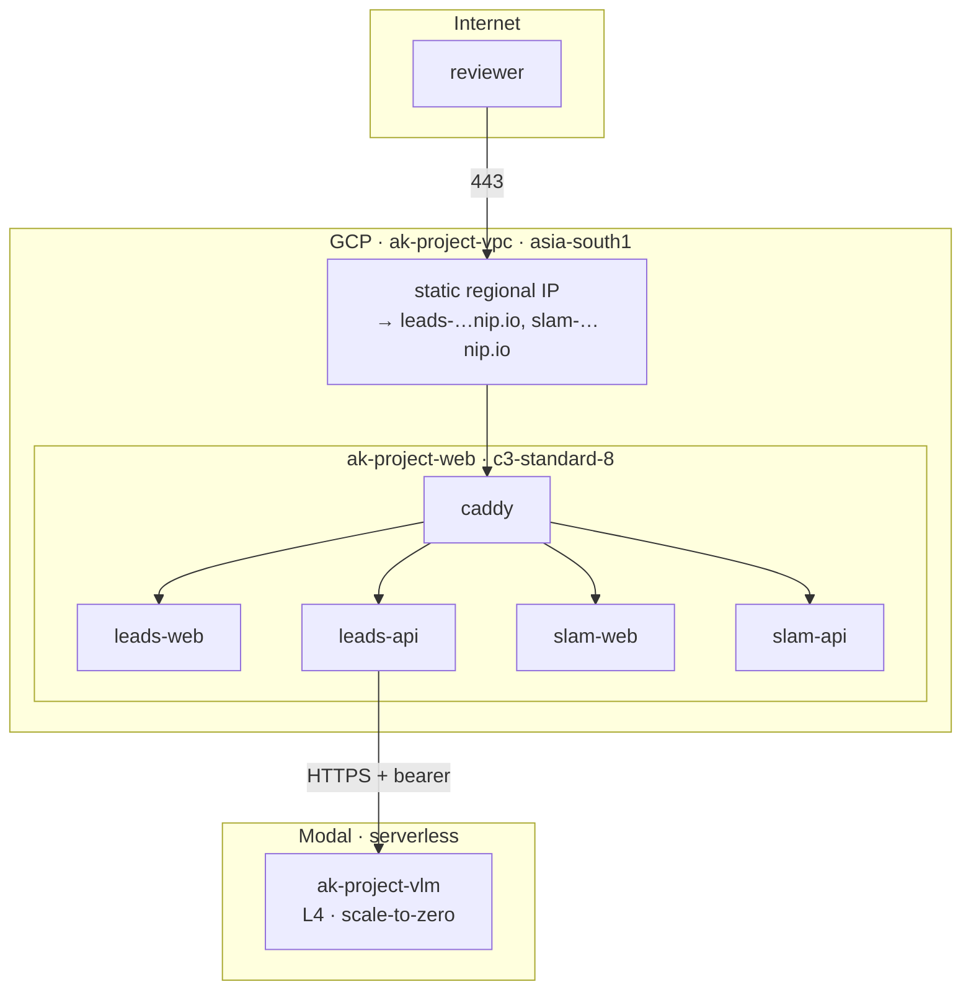

# 01 — Architecture

## The shape of the system

Three tiers, each independently replaceable, connected by two contracts: the HTTP API in
[`_contracts/assignment1-api.md`](../../_contracts/assignment1-api.md), and OpenAI's
`/v1/chat/completions` wire format.



Why these boundaries and not others:

- **Caddy owns TLS and path routing, nothing else.** Certificates are automatic and the
  hostname is derived from the instance's own IP at boot, so moving the stack to a new IP
  re-issues certificates without editing a config file. `flush_interval -1` disables
  response buffering — without it the SSE stream would stall inside the proxy until the
  batch finished, which defeats the point of streaming.
- **The API is the only stateful service.** SQLite plus a directory of images, both under
  `DATA_DIR`. That is what keeps `docker compose up` to two containers.
- **The GPU is a separate deployment with its own lifecycle.** It scales to zero, it is
  reachable over the public internet behind a bearer key, and the API treats it as a remote
  dependency that can be cold, slow or absent. Swapping it for any other OpenAI-compatible
  endpoint — a local vLLM, llama.cpp, a hosted API — is one environment variable.

## Request lifecycle of one batch



Four details in that sequence are deliberate and worth calling out.

**`POST /batches` returns before any work happens.** It returns `201` with every lead in
`queued` and fans the work out onto a background task. A 25-card upload therefore does not
hold an HTTP connection open for a minute, and the client has a batch id to subscribe to
immediately.

**The concurrency semaphore is held across preprocessing *and* inference**, not just the
model call. That is what lets `card.started` fire at the moment a card actually wins a slot.
Emit it at task-creation time instead and all 25 cards report the same start timestamp, which
makes per-card timing meaningless.

**`processing_ms` is work, not wall clock.** It is preprocessing time plus inference time,
each measured inside its own worker. A card that merely queued behind five others is not
reported as a slow card. Batch wall clock is a separate field, `Batch.elapsed_ms`.

**`GET /health` never touches the GPU.** Any request to the endpoint wakes it, so a frontend
polling health would pin a container warm and burn GPU-seconds indefinitely. Warmth is
*derived*: time since the last successful completion, against the 900 s scale-down window.
Reachability is observed from real traffic rather than tested.

## Data flow inside one card



Full treatment in [03 — the extraction pipeline](03-extraction-pipeline.md).

## Module layout and why it is drawn this way

The rule is one module per real concept. Three concepts are large enough to be packages;
everything else is a single file. There is no `interfaces/`, no `factories/`, no DI
container.

```
backend/app/
├── main.py         app factory, CORS, request-id middleware, lifespan, error shape
├── models.py       pydantic models mirroring the contract, field weights, Settings
├── store.py        SQLite (stdlib sqlite3, WAL) for state; plain files for images
├── pipeline.py     batch fan-out, bounded concurrency, the SSE event bus
├── export.py       styled .xlsx (Leads / Summary / Raw) and .csv
├── routes/
│   ├── batches.py      upload, snapshot, retry, both exports
│   ├── leads.py        PATCH a lead, serve the original image and its thumbnail
│   ├── events.py       the SSE endpoint
│   ├── health.py       liveness, the /health alias, fire-and-forget warm-up
│   └── deps.py         request-scoped accessors + the contract's error type
├── extract/
│   ├── preprocess.py   decode, orient, downscale, measure legibility
│   ├── normalise.py    names, phones, emails, websites, locations
│   ├── confidence.py   cross-field validation, scoring, the needs_review decision
│   └── dedup.py        duplicate detection across a batch
└── vlm/
    ├── prompt.py       system/user prompts and the JSON schema
    ├── client.py       providers, retries, cold-start handling, warmth
    └── parse.py        tolerant parse + payload normalisation
```

The dependency arrow points one way: `main` → `routes` → `deps` → (`store`, `pipeline`,
`vlm`, `extract`) → `models`. Nothing in `extract/` imports a route; nothing in `vlm/` knows
what a `Batch` is. Two consequences that are not accidents:

- **`store.py` and `EventBus` are the only obstacles to horizontal scaling.** Swapping SQLite
  for Postgres and the in-process bus for Redis pub/sub is a change to two modules, not a
  rewrite. See [ADR-0006](adr/ADR-0006-sqlite-and-local-disk-over-postgres.md).
- **The provider abstraction is one class, not a plugin system.** `stub`,
  `openai_compatible` and `modal` share one code path in `vlm/client.py`. The `stub` provider
  is what makes the entire test suite and the entire product demoable offline.

## Frontend structure

Server components by default; `'use client'` only where interaction demands it. Two routes:
`/` (hero + ingest) and `/b/[batchId]` (live run, review, export). Detail in
[05 — frontend](05-frontend.md).

The one architectural decision worth surfacing here: the batch page keeps leads in a `Map`
with per-card listener sets, and each tile subscribes to *its own card id* through
`useSyncExternalStore`. A 25-card batch streaming updates therefore never re-renders the
grid. Continuous values — progress, elapsed time, every metric — are written into Framer
motion values and never trigger a React render at all.

## Deployment topology



One VM hosts both assignments behind one Caddy instance; each app has its own hostname via
[nip.io](https://nip.io), which resolves `leads-34-47-153-95.nip.io` to `34.47.153.95` and
sits on the Public Suffix List, so each subdomain gets its own certificate and its own
Let's Encrypt rate-limit budget. No domain registration, no DNS zone.

Provisioning is a single idempotent script (`infra/provision.sh`): a dedicated VPC, two
firewall rules, a static IP, and the VM with `bootstrap.sh` as its startup script. SSH is
**not** open to the internet — port 22 is reachable only from Google's Identity-Aware Proxy
range, so access is `gcloud compute ssh --tunnel-through-iap` and nothing else. Deployment
(`infra/deploy.sh`) streams source to the VM over that tunnel and builds images **on the VM**,
which removes registry auth entirely and sidesteps the arm64/amd64 mismatch an Apple Silicon
laptop would otherwise produce. The runbook is [`../../infra/README.md`](../../infra/README.md).

## AWS equivalents

The brief specified AWS. This is deployed on **GCP Compute Engine**, at the author's
direction, because that is the account with billing and quota available. It is said here
plainly rather than buried, because the substitution is the sort of thing a reviewer should
hear from the candidate first.

Nothing in the design is GCP-specific. The entire runtime is a `docker-compose.yml` and a
`Caddyfile` on one Linux box — deliberately the most portable shape this could take. The port
is a rewrite of the provisioning script, not of the application.

| This deployment (GCP) | AWS equivalent |
|---|---|
| `c3-standard-8` — 8 vCPU / 32 GiB, Xeon Platinum 8481C (Sapphire Rapids) | **`m7i.2xlarge`** — 8 vCPU / 32 GiB, exact match. `c7i.2xlarge` matches the CPU generation but halves the RAM. |
| Static regional external IP | **Elastic IP**, associated with the instance |
| Firewall rule tcp:80,443 from `0.0.0.0/0`, scoped by network tag | **Security group** inbound rules on 80/443; network tags → SG membership |
| Firewall rule tcp:22 from the IAP range only | **No inbound 22 at all**; **SSM Session Manager** (`aws ssm start-session`). Same posture: no public SSH port. |
| Dedicated VPC + subnet | **VPC** + public subnet + internet gateway + route table |
| Instance `startup-script` metadata → `bootstrap.sh` | **EC2 user-data**, byte-for-byte the same script |
| 100 GiB `pd-balanced` boot disk | **100 GiB `gp3` EBS** volume |
| Ubuntu 24.04 LTS image family | Canonical Ubuntu 24.04 LTS AMI |
| `gcloud compute ssh --tunnel-through-iap` | `aws ssm start-session --target i-…` |

`docker-compose.yml`, `Caddyfile`, `bootstrap.sh` and the systemd unit transfer
**unchanged**. Only `provision.sh` and `teardown.sh` are rewritten, roughly one-for-one
against `aws ec2 run-instances` / `allocate-address` / `authorize-security-group-ingress`.

**If you would rather not run a VM at all:** LeadForge's two services are stateless apart
from `DATA_DIR`, so `leads-web` and `leads-api` map cleanly onto **ECS Fargate** behind an
**Application Load Balancer** with TLS from **ACM** — at which point Caddy's only remaining
job is path routing, and the ALB listener rules (`/api/*` → the API target group, `/*` → the
web target group) replace it outright. `DATA_DIR` becomes an **EFS** mount, or the store
moves to RDS + S3 as described in
[ADR-0006](adr/ADR-0006-sqlite-and-local-disk-over-postgres.md). Two caveats before anyone
does that: the ALB idle timeout must be raised past its 60 s default or it will cut the SSE
stream, and the GPU stays where it is — Fargate has no GPU, so the equivalent AWS move for
the model tier is SageMaker Serverless Inference or an ASG of `g6.xlarge` (also L4) scaled to
zero, which is a materially more complex piece of infrastructure than the one this uses.

## Failure behaviour

| Failure | What happens |
|---|---|
| GPU is cold | First request waits out the boot under `VLM_COLD_TIMEOUT_S` (420 s). `/health` reports `warm: false` beforehand, so the UI can warn and offer `POST /vlm/warmup`. |
| GPU returns 5xx / 429 / times out | Up to `VLM_MAX_RETRIES` attempts, exponential backoff with full jitter so a batch's retries spread instead of resonating. |
| Model returns unparseable output | Tolerant parse first (code fences, outermost balanced object), then **one repair turn** handing the model its own bad output back. |
| One card fails | That card alone goes `failed` with an error message; the batch finishes as `partial`. `POST /batches/{id}/retry` re-queues only the failures, and the dedup window is seeded from what already succeeded so relationships survive the retry. |
| SSE connection drops | The client reconnects with exponential backoff and, after three consecutive failures, falls back to polling `GET /batches/{id}`. A late subscriber gets a snapshot plus a synthesised `batch.completed` reconstructed from the database — which also covers a server restart. |
| API restarts mid-batch | Everything already persisted survives. Cards that were in flight are left in `processing` and are **not** resumed automatically — `POST /batches/{id}/retry` with their `card_ids` recovers them. A real limitation, named in [07](07-limitations.md). |
