# 02 — Model serving

> Deployment recipe, auth verification and the full tuning log live in
> [`../infra/modal/README.md`](../infra/modal/README.md). This document is the *why*.

## What "deploy a Qwen VLM" was taken to mean

The brief asks for a Qwen vision-language model deployed on a free-tier or equivalent server.
That admits two readings: call somebody's hosted Qwen API, or actually stand up the model.
This takes the second reading — the deliverable is a **self-hosted inference server that this
project owns, configures and pays for**, not an API key to someone else's. See
[ADR-0002](adr/ADR-0002-self-hosted-vllm-on-serverless-gpu.md).

| | |
|---|---|
| Model | `Qwen/Qwen2.5-VL-3B-Instruct`, Apache-2.0 |
| Revision | pinned `66285546d2b821cf421d4f5eb2576359d3770cd3` |
| Engine | vLLM 0.28.0, V1 engine, xgrammar structured outputs |
| Hardware | one **L4** (24 GB), serverless: `min_containers=0`, `max_containers=2`, `scaledown_window=900 s` |
| Interface | OpenAI-compatible `/v1`, so the backend uses the stock `openai` async client |
| Auth | `Authorization: Bearer $VLM_API_KEY` on every route except `/health` and `/metrics` |
| Idle cost | **$0** — no container exists when nobody is uploading |

The revision pin matters more than it looks. An upstream re-upload to the same tag would
otherwise silently change what a deployed endpoint serves, and the first sign would be a
quality regression nobody can reproduce.

## Why 3B

Measured, not assumed: **3/3 benchmark cards extracted with every field correct on every
run**, including one deliberately blurred, rotated and unevenly lit to stand in for a phone
photo. Against the 20-card ground-truth corpus, 88 % of fields on non-degraded cards. A
business card is a *small amount of large, high-contrast text* — the task is much closer to
OCR-with-layout-understanding than to open-ended visual reasoning, and that is exactly where a
3B VLM saturates.

Going to 7B-AWQ would roughly double per-card latency and add to an already 210-second cold
start, for a quality gain this corpus cannot detect. Full reasoning:
[ADR-0001](adr/ADR-0001-qwen2.5-vl-3b-over-larger-variants.md).

## Cold start, honestly

The container does not exist between batches. That is the entire value proposition of
scale-to-zero, and its entire cost lands on one request.

| Configuration | Range | Median |
|---|---|---|
| First-ever boot, empty volumes, torch.compile cold | 258–300 s | — |
| `--no-enforce-eager`, caches warm (3 boots) | 240–248 s | 246 s |
| **`--enforce-eager`, caches warm (5 boots, shipped)** | **187–237 s** | **210 s** |

Where a 210 s boot actually goes:

```mermaid
gantt
    title Cold-start anatomy (~210 s, enforce-eager, warm caches)
    dateFormat X
    axisFormat %S s
    section Boot
    Modal container start, image pull, python import :0, 50
    Weight load from cache volume                    :50, 54
    vLLM engine init (dummy forward passes dominate) :54, 159
    Multimodal warmup                                :159, 172
    uvicorn binds, endpoint answers                  :172, 210
```



The surprise in that profile is that engine init is dominated by **dummy forward passes in
`compile_or_warm_up_model`**, not by compilation. That is why moving Triton and Inductor
caches into a persistent volume — the obvious optimisation — did not measurably help. It is
kept anyway, because it stops artefacts landing on ephemeral `/tmp`, which matters if
`--enforce-eager` is ever turned off.

Three consequences the client is built around:

1. **`VLM_TIMEOUT_S` must be ≥ 300.** The contract's original 120 s default failed *every*
   first request after an idle period. The client uses a separate `VLM_COLD_TIMEOUT_S` (420 s)
   until the first success and again whenever warmth has lapsed.
2. **Never probe the model from `/health`.** Any request wakes the GPU. A frontend polling
   health every few seconds would pin a container warm forever and quietly spend the budget.
   Warmth is derived from time since the last successful completion against the 900 s
   scale-down window (`WARM_TTL_S`, which must track `scaledown_window`).
3. **Follow redirects.** The platform answers `303` while a container boots. `httpx` and the
   `openai` client do this by default; `curl` needs `-L`.

The UI surfaces all of this: a *Cold* pill on the model chip, and `POST /api/v1/vlm/warmup`,
which fires a one-token completion in the background and returns immediately so the user can
keep dragging cards in while the GPU boots.

## Warm performance

L4, fixed benchmark fixtures, client in `ap-south`, so public-internet RTT is included.
Modal L4 containers vary by roughly **25–30 % between instances**, so every figure is a range
over multiple runs on different containers rather than one flattering sample.

| | |
|---|---|
| Single card, one at a time | **6.2–11.4 s** |
| Output length | ~199 tokens/card — the schema includes a full `raw_text` transcription |
| Single-stream decode | 18–31 tok/s |
| **6 concurrent** (matches `VLM_CONCURRENCY=6`) | **0.50–0.67 img/s**, 100–133 output tok/s |
| **25-card batch, warm** | **37–50 s** |

Methodology and how to reproduce: [06 — performance](06-performance.md).

## The tuning that mattered

Four flags earn their place; one was tried and removed.

**`--enforce-eager`** is the one genuine trade in the deployment: about 35 s off the median
cold start in exchange for ~20 % of decode throughput. It wins *only because this endpoint
scales to zero*. On a cold 25-card batch the arithmetic is 210 s boot + 47 s inference = 257 s
eager, against 246 s + 32 s = 278 s with CUDA graphs. On a permanently warm endpoint the trade
reverses, and one constant in `qwen_vlm.py` flips it.

**`--limit-mm-per-prompt '{"image": 1, "video": 0}'`.** Left at its default, vLLM profiles
and warms the engine against a *maximum-size video* — a capability this endpoint never
exposes. Setting video to 0 cut peak activation memory from 0.54 GiB to 0.21 GiB and handed
0.3 GiB back to the KV cache.

**`--mm-processor-kwargs '{"min_pixels": 200704, "max_pixels": 1003520}'`.** Caps a card at
1280 visual tokens (one token per 28×28 patch) so a 4096-token context comfortably holds the
image, the grammar and the answer. Without the cap Qwen2.5-VL will spend 12 k+ tokens on a
large photo and overflow the window. This is also why the backend downscales to 1280 px at
q=88 before encoding: it lands just under the processor's 1.0 MP cap, so nothing is resampled
twice.

**`temperature=0` passed explicitly on every call.** The model's own
`generation_config.json` otherwise applies `repetition_penalty=1.05` and `temperature=1e-6`,
which vLLM honours by default — and a repetition penalty is actively harmful when the task is
faithful transcription of text that legitimately repeats (a domain appearing in both the email
and the website, for instance).

**`cpu=4.0` was tried and removed.** It bought ~6 % throughput for ~16 % more cost per
container-second, which is the wrong trade on a cold-start-dominated workload.

## Auth: the route vLLM leaves open

vLLM's built-in `--api-key` middleware only guards paths under `/v1`, `/v2`, `/inference` and
`/cohere`. That leaves **`/invocations`** — a SageMaker-compatibility route that accepts the
same request bodies as `/v1/chat/completions` — completely unauthenticated. On a metered GPU
that is a direct path from "someone has the URL" to "someone is spending the budget".

`infra/modal/vlm_auth.py` adds a second ASGI middleware that guards everything except
`/health` and `/metrics`, neither of which runs the model. Verified against the live
deployment:

```
/v1/models    no key -> 401      /health   no key -> 200
/tokenize     no key -> 401      /metrics  no key -> 200
/invocations  no key -> 401      /invocations with key -> 200
```

The endpoint is publicly reachable by design, so the bearer key is the only thing between the
URL and the credit balance. It lives in a Modal Secret and in the deployment host's `.env` —
never in this repository.

## Cost model

Modal charges per container-second while a container exists, and nothing while scaled to zero.

```
L4          $0.000222 / s
CPU+memory  $0.000019 / s
total       $0.000241 / s   =  $0.87 per hour of container wall-clock
```

| Scenario | Container seconds | Cost |
|---|---|---|
| 25-card batch from cold | 210 boot + 47 infer + 900 idle tail | **$0.28** |
| 25-card batch, already warm | 47 infer (+ shared idle tail) | **$0.011** |
| Per card, warm | ~1.9 | $0.0005 |
| Idle overnight | 0 | **$0.00** |

The `scaledown_window` is the main lever, set to **900 s**. Cold start is ~190–260 s and is
model-load-bound rather than compute-bound, so no larger GPU meaningfully fixes it; keeping
the container alive between batches is the only thing that does. 900 s means a reviewer who
uploads a second batch within 15 minutes pays no cold start at all, at the price of an
abandoned tab costing ~$0.22 of idle instead of ~$0.06 — roughly $0.20 per session to remove
a 3½-minute wait from the demo. Weight download runs once on a CPU container (~28 s, ~$0.0005)
rather than burning L4 seconds on a 7 GB pull.

## Swapping the model

Two constants at the top of `infra/modal/qwen_vlm.py`, then re-run the download and deploy:

```python
MODEL_NAME = "Qwen/Qwen2.5-VL-7B-Instruct-AWQ"
MODEL_REVISION = "<commit sha from the HF model page>"
```

```bash
modal run qwen_vlm.py::download_model && modal deploy qwen_vlm.py
```

7B-AWQ fits an L4 (~6 GB of weights, ~13 GB left for KV cache); expect roughly 2× the
per-card latency. `VLM_MODEL` in the backend must be updated to match, because
`--served-model-name` is the full Hugging Face id.

Nothing in the deployment file is workspace-specific — the URL is derived from whichever
Modal profile is active — so the same file deploys into any workspace. Confirm the target
first (`modal profile current`), because `modal deploy` will otherwise publish somewhere
unintended without complaining.
