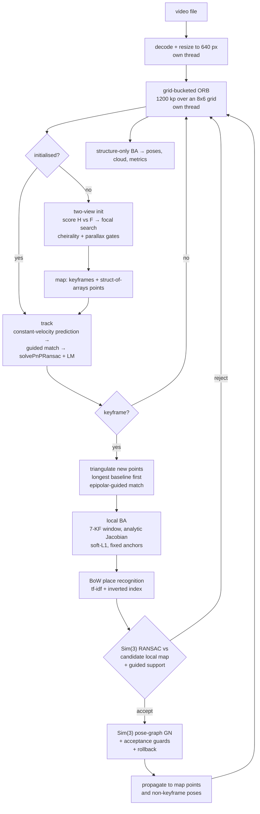

# 02 — The SLAM algorithm

This is the technical centre of the submission. It walks the pipeline end to end with the
mathematics stated rather than gestured at, and names the file and function for every stage
so a claim here can be checked against code in one jump.

Everything lives in [`../slam/`](../slam/) and is pure Python over `numpy`,
`opencv-python-headless` and `scipy`. There is no GPU kernel, no C++ extension, no
pretrained network, and no SLAM library — OpenCV supplies primitives (FAST/ORB, RANSAC for
F/E/H, `solvePnPRansac`, `triangulatePoints`) and the SLAM *system* on top of them is the
work.



---

## 0. Conventions

A pose is stored as `T_cw ∈ SE(3)`, camera-from-world:

```
x_c = R x_w + t,    T_cw = [ R  t ]
                           [ 0  1 ]
```

and reported to callers as `T_wc = T_cw⁻¹`, because a renderer wants the camera's position
in the world, not the world's position in the camera. `position` in the API is the camera
centre `c = −Rᵀt`; `quaternion` is `[qw, qx, qy, qz]` of `R_wc = Rᵀ`.

Tangent vectors are ordered `[v (3), ω (3)]` for `se(3)` and `[v (3), ω (3), σ (1)]` for
`sim(3)`, matching Sophus. **Right (body-frame) perturbations are used throughout**:
`T ← T · Exp(δ)`. Getting this wrong is the classic silent SLAM bug — the optimiser still
converges, just to the wrong thing, and the residual plot looks fine.

Everything is **up to scale**. The initial two-view baseline is fixed to `‖t‖ = 1`.

---

## 1. Lie group machinery — `geometry.py`

### SO(3)

`so3_exp` / `so3_log` delegate to `scipy.spatial.transform.Rotation` (Rodrigues under the
hood). The left Jacobian is written out because `se3_exp` needs it:

```
J_l(ω) = I + (1 − cos θ)/θ² · [ω]ₓ + (θ − sin θ)/θ³ · [ω]ₓ²,     θ = ‖ω‖
```

with a third-order Taylor branch `I + ½[ω]ₓ + ⅙[ω]ₓ²` below `θ < 1e-7`, because the `1/θ³`
term is catastrophic there.

### SE(3)

```
Exp([v, ω]) = [ Exp(ω)   J_l(ω) v ]
              [   0          1    ]
```

and `se3_log` solves `J_l(ω) u = t` for the translation part rather than inverting `J_l`.

### Sim(3)

A similarity is carried as the triple `(s, R, t)` acting as `x ↦ s·R·x + t`, never as a 4×4
with a baked-in scale — that keeps `s` visible and lets the pose graph reason about scale
explicitly. Composition and inverse:

```
(s₁,R₁,t₁) ∘ (s₂,R₂,t₂) = (s₁s₂,  R₁R₂,  s₁ R₁ t₂ + t₁)
(s,R,t)⁻¹                = (1/s,   Rᵀ,    −Rᵀt / s)
```

The exponential for `ξ = [v, ω, σ]` is `s = e^σ`, `R = Exp(ω)`, `t = W v` with

```
W = A [ω]ₓ + B [ω]ₓ² + C I
```

where `(A, B, C)` are the standard Sim(3) coefficients (`_sim3_W`), which have **four**
branches — `σ ≈ 0` × `θ ≈ 0` — each with its own Taylor expansion. All four are implemented;
skipping them is how a Sim(3) pose graph acquires NaNs on a near-planar loop.

The adjoint, used for the pose-graph Jacobian, is derived from `S ξ^ S⁻¹`:

```
v' = s R v + [t]ₓ R ω − σ t
ω' = R ω
σ' = σ
```

giving the 7×7

```
Adj(S) = [ sR   [t]ₓR   −t ]
         [ 0      R      0 ]
         [ 0      0      1 ]
```

The inverse right Jacobian is approximated as `J_r⁻¹(r) ≈ I + ½ ad(r)`, exact to `O(‖r‖²)`.
Pose-graph residuals are small near the solution, so this costs nothing measurable in
accuracy and avoids evaluating the closed-form 7×7 series every edge, every iteration.

Tests: [`../tests/test_geometry.py`](../tests/test_geometry.py) checks `exp`/`log`
round-trips, `Adj(S)·ξ == (S·Exp(ξ)·S⁻¹)^∨`, and the small-angle branches against their
large-angle counterparts across the branch boundary.

---

## 2. Features — `features.py`

**Grid-bucketed ORB.** `cv2.ORB_create(nfeatures=1200).detectAndCompute` clumps keypoints
onto the few highest-contrast patches in a frame. That is bad twice over: PnP becomes
ill-conditioned because all constraints come from one image region, and triangulation
inherits the same anisotropy.

So: over-detect at 2× the budget with a relaxed FAST threshold, assign every keypoint to one
of `8 × 6 = 48` cells, and keep the strongest `⌈1200/48⌉ = 25` responses per cell, then
top up or trim globally by response to land exactly on 1200. The per-cell ranking is done
without a Python loop — lexsort by `(cell, −response)`, then `rank = index − running-max of
cell-start-index` — so the whole bucketing step is two OpenCV calls plus a handful of NumPy
ops instead of `rows × cols` separate `detect` calls.

A frame that yields fewer than `max_features/2` keypoints is retried once with
`fastThreshold=5` instead of `12`, rather than letting the tracker starve on a low-texture
wall.

**Matching.** Hamming distance with Lowe's ratio test, but through `cv2.batchDistance`
rather than `BFMatcher.knnMatch`, because it returns NumPy arrays instead of a Python list
of `DMatch` objects and the ratio test stays vectorised — measured **0.65 ms vs 1.1 ms** for
1200 × 1200 descriptors.

The ratio threshold is **0.8**, not the textbook 0.75. On repetitive indoor texture 0.75
throws away roughly 45 % of correct matches; RANSAC downstream is cheaper than starving the
tracker.

**Two geometric gates** turn `O(MN)` Hamming comparisons into something affordable and, more
importantly, let the ratio test run loose for the same outlier rate:

- `proximity_mask` — a uint8 `(M, N)` gate, 1 where a keypoint is within ~`radius` px of a
  projected map point. Quantising to cells before comparing halves the cost against float
  differencing (1.2 ms vs 2.1 ms at 800 × 1200). The window is a square rather than a disc;
  PnP RANSAC removes what the corners admit.
- `epipolar_mask` — 1 where `b` lies within `threshold` px of `a`'s epipolar line under a
  known `F`. This is ORB-SLAM's `SearchForTriangulation` and it is one BLAS matmul.
  Unconstrained mutual matching between two keyframes recovers only ~25 % of the
  correspondences on repetitive indoor texture, and the map starves.

**Mutual (cross-check) matching** is mandatory under a geometric mask, and the reason is
subtle enough to be worth stating: an epipolar band is a *line*. A wrong match anywhere
along that line triangulates to a 3D point that reprojects **perfectly in both views**, so it
survives every downstream geometric check — cheirality, reprojection, parallax — and then
simply never matches again, quietly poisoning the map. The both-ways ratio test is what
catches it.

`dedupe_by_distance` keeps one query per train index. Guided matching projects many map
points into the same neighbourhood and several can claim the same keypoint; letting both
through feeds PnP duplicate observations of one measurement, which is not a second
constraint.

---

## 3. Initialisation and self-calibration — `tracking.py`

### Model selection: homography vs essential

A monocular system has a well-known degeneracy: if the scene is dominated by a plane, the
essential matrix is not determined by the data. Decomposing it anyway produces a plausible
pose and a garbage map. ORB-SLAM's answer, implemented here, is to fit **both** models and
score them symmetrically.

For the homography, the symmetric transfer error with a χ² gate at 2 DoF (`5.991`):

```
S_H = Σᵢ [ ρ(5.991 − ‖p₂ᵢ − H p₁ᵢ‖²/σ²) + ρ(5.991 − ‖p₁ᵢ − H⁻¹ p₂ᵢ‖²/σ²) ]
```

For the fundamental matrix, the symmetric epipolar distance with a 1 DoF gate (`3.841`):

```
d²(p₂, F p₁) = (p₂ᵀ F p₁)² / ((F p₁)₁² + (F p₁)₂²)
S_F = Σᵢ [ ρ(· − d²(p₂ᵢ, Fp₁ᵢ)) + ρ(· − d²(p₁ᵢ, Fᵀp₂ᵢ)) ]
```

with `ρ(x) = max(x, 0)`. The selector is `R_H = S_H / (S_H + S_F)`; **`R_H > 0.45` takes the
homography path**, otherwise the essential path.

Both paths then normalise the baseline to `‖t‖ = 1` before triangulating. This matters more
than it looks: `recoverPose` already returns a unit translation, but
`decomposeHomographyMat` returns one scaled by the plane distance. Without the
normalisation the two paths would produce maps in different gauges and every threshold
downstream expressed "relative to scene scale" would mean two different things.

On the bundled clips this is not theoretical. `synthetic_loop` initialises through the
**homography** path (`init_model: "homography"` in `report.json`) — the camera starts facing
a large flat wall section. `synthetic_corridor` initialises through the essential path.

### Focal length from the video itself

Consumer video ships no intrinsics. Driftless assumes a pinhole camera with square pixels
and the principal point at the image centre, then estimates `f` in two stages.

**Stage 1 — Sturm/Bougnoux self-calibration from `F`.** A true essential matrix has singular
values `(s, s, 0)`. So sweep `f` over `[0.55w, 1.45w]` in 13 steps, form
`K = diag(f, f, 1)` with the centre principal point, take the SVD of `KᵀFK`, and score the
normalised gap:

```
data(f)  = |σ₀ − σ₁| / (σ₀ + σ₁)
score(f) = data(f) + λ · log²(f / f_prior),     λ = 0.02,  f_prior = 0.8·w
```

Thirteen 3×3 SVDs — essentially free. The log-normal MAP prior exists because the data term
is **close to flat whenever motion is rotation-dominated**, which handheld video very often
is, and a flat data term biases long. `λ = 0.02` is weak enough that it only decides the
answer when the data genuinely cannot.

**Stage 2 — bundle adjustment owns it, once.** Two-view self-calibration only ever gets `f`
to about ±15 %. Once six keyframes of real 3D structure exist, at keyframe 6 the system runs
one wide-window BA with `fx = fy` **free**, carried as `log f` so the step is scale-relative
and `f` can never go negative (`d(u,v)/d(log f) = f·(x/z, y/z)`), then freezes it again.
That run is deliberately excluded from the reported `ba_before_px` / `ba_after_px`: it starts
from a knowingly wrong focal, so folding it in would flatter the local-BA figure.

Measured on the synthetic clips, where ground truth is exact: true `f = 900` at 1280 px
→ `450` at the 640 px tracking width. Recovered: **501.8** on `synthetic_loop` (+11.5 %),
**446.0** on `synthetic_corridor` (−0.9 %). The corridor is essentially perfect; the loop
is over-estimated, and that residual focal error is one of the two things
[07 — Limitations](07-limitations.md) blames for its comparatively poor ATE.

### Triangulation gates

A freshly triangulated set is filtered on four conditions simultaneously
(`_filter_triangulation`):

1. **Cheirality** — positive depth in *both* cameras.
2. **Finiteness** — `triangulate` maps `w ≈ 0` (points at infinity) to `(0,0,−1)` so the
   cheirality filter drops them instead of `±inf` propagating into the map.
3. **Parallax** — the angle at the 3D point between the two viewing rays must exceed
   `init_min_parallax_deg = 2.0°`. This is the single most important gate in the system and
   [03 — Drift mitigation](03-drift-mitigation.md) is largely about why.
4. **Reprojection** — under 2.0 px in both views.

Initialisation additionally requires ≥ 80 matches, ≥ 60 inliers, ≥ 100 surviving points, and
a *median* parallax above 2°. If the reference frame goes 45 frames without a successful
init it slides forward rather than retrying the same hopeless pair forever.

---

## 4. Tracking — `tracking.py`

Two stages per frame, as in ORB-SLAM, and the split is load-bearing.

**Stage A — seed from the previous frame.** The constant-velocity model predicts
`T̂ = V · T_prev` where `V` is the previous inter-frame motion, composed on `SE(3)`. That
prediction places the guided-match search windows over the previous frame's associated map
points; `solvePnPRansac` (EPnP, 120 iterations, 3 px, 0.995 confidence) plus
`solvePnPRefineLM` on the consensus set yields a *measured* pose.

**Stage B — re-project the whole local map using the measured pose from A.** The local map is
the reference keyframe's points unioned with its 12 most covisible neighbours'.

Why both: if the search windows are *only ever* centred on the prediction, the only matches
that can survive are the ones consistent with the prediction, the prediction reproduces
itself, and the trajectory collapses toward "no motion". Stage B breaks that loop by
re-projecting from a pose the data chose.

The same reasoning explains a deliberate non-use of an OpenCV feature:

> `solvePnPRansac` is called **without** `useExtrinsicGuess`, on purpose. With it, OpenCV
> refines every minimal-sample hypothesis starting from the guess, so a constant-velocity
> prediction of "nearly stationary" reproduces itself and the trajectory stalls. The
> prediction is already used where it belongs — to place the search windows.

**The search radius adapts to predicted rotation.** A fixed 14 px window is fine at the
~1.2°/frame a handheld camera averages, but real footage contains 4–8°/frame pans, which
move features 35–70 px:

```
radius = clip(14 + f·tan(min(Δθ, 0.5)),  14,  14 × 6)
```

and the ratio test **tightens** as the window opens, from 0.95 down to 0.80, interpolated
linearly in the growth factor. The window and the descriptor test jointly set the outlier
rate; holding the ratio loose while the window grows drops the PnP inlier ratio far enough
to lose tracking outright.

**Fallback ladder**, in order: guided match → the same at 2.5× radius → descriptor-only
mutual match against the previous frame (no positional prior at all, so a wrong prediction
cannot poison it) → local-map match with a window widened in proportion to how many frames
have been dropped → after 3 consecutive failures, BoW relocalisation against the keyframe
database.

While lost, the prediction keeps **dead-reckoning** (up to 8 steps) instead of freezing.
Freezing is what turns one bad frame into permanent loss: the search windows stop following
the camera and nothing can ever match again. For the same reason a failed frame does **not**
clear the previous frame's associations — those are the only bootstrap the next frame has.

---

## 5. Keyframes and mapping — `pipeline.py`, `mapping.py`

### The map is a struct of arrays

`PointStore` holds `xyz`, `desc`, `rgb`, `obs_count`, `ref_kf`, `first_kf`, `bad` as parallel
NumPy arrays with geometric growth, not a list of `MapPoint` objects. Every hot query —
project the local map, gather BA observations, cull — is then a vectorised op rather than a
per-point interpreter loop. That is the difference between hitting and missing the frame
budget.

A map point's representative descriptor is **refreshed from the newest keyframe that sees
it**. A point that keeps the descriptor it was born with stops matching after roughly ten
frames of viewpoint change, and the tracked count then decays ~30 % per frame until tracking
dies.

### When to insert a keyframe

In order (`_needs_keyframe`): never before 3 frames, never on a frame with fewer than 18
inliers, always after 18 frames. Between those, a **geometric** criterion:

```
baseline / median-depth  >  kf_min_parallax_ratio = 0.13        (≈ 7.4°)
```

An earlier version used only the tracked-ratio test, which couples the keyframe rate to how
many matches the tracker happens to find. Widening the search window for fast pans then
*suppressed* keyframes, starved the map and cost 70 frames of coverage — the exact opposite
of what widening the window was for.

A rotation trigger sits beside it (`> 8°` since the last keyframe), because a translation
criterion says nothing about a pan, and a pan is precisely what rotates the existing map out
of view.

### New-point triangulation, longest baseline first

This is the part most implementations get wrong, and the measured consequence is large.

Covisibility naturally ranks the *most recent* keyframes highest — and those are exactly the
short-baseline, ill-conditioned pairs. So the neighbour pool is the union of the 20 most
covisible keyframes and the last 12 by index, then **sorted by descending baseline**, then
filtered to those whose `baseline / ref_depth > tan(2.5°)`, and the first 12 are used.

Quality first, quantity second: long-baseline pairs get first pick of the unmatched
keypoints, and shorter baselines are only consulted if the keyframe still has fewer than 150
new points. Taking *only* long baselines starves the map (coverage fell to 143/300); taking
them all lets ill-conditioned pairs set the scale.

Each pair is matched under `epipolar_mask` with a Sampson-distance filter at 3 px, then
triangulated and gated on cheirality in both views, parallax > 2.5°, reprojection < 4 px,
and a **depth cap** at `3 × ref_depth`. A new point much farther away than the map it is
joining is almost always a low-parallax artefact, and those drive scale drift: an over-long
depth inflates the next pose, which inflates the next triangulation. Measured on
`synthetic_loop`, the depth cap plus baseline-ordered neighbour selection took end-of-loop
scale inflation from **7.4× to ~1.1×**.

### Culling

ORB-SLAM's recent-map-point culling, at a different threshold. A point that, three keyframes
after birth, still has fewer than `map_point_min_obs` observations is a triangulated
mismatch and is dropped. ORB-SLAM uses 3 observations; at 3 here it removed ~60 % of the map
and tracking died around frame 220, because this system's match rates are not ORB-SLAM's. At
**2** the map is 2.5× denser, coverage is 298/300, and accuracy is unchanged.

---

## 6. Local bundle adjustment — `mapping.py::local_bundle_adjust`

### The problem

Minimise reprojection error over the newest `ba_window = 7` keyframe poses and every map
point they observe:

```
min over {T_i}, {X_j}    Σ_(i,j) ∈ Obs   ρ( ‖ π(K, T_i, X_j) − u_ij ‖² )
```

with

```
π(K, T, X) = ( f·(T X)_x / (T X)_z + c_x ,  f·(T X)_y / (T X)_z + c_y )
```

Keyframes **outside** the window that also observe those points enter as **fixed anchors**.
That is what stops the window from drifting away from the older map — the cheap stand-in for
proper marginalisation, and the reason this is a sliding-window filter rather than seven
keyframes floating free.

### The monocular gauge trap

A *single* fixed camera is not enough. Rescaling every point and every free camera
translation about one fixed camera leaves all projections identical — it is an exact null
direction of the Hessian. That null direction let the window shrink by ~10 % per BA run
early in a sequence, which reads downstream as violent scale drift. **Two** fixed cameras
remove it, and the code falls back to fixing two whenever fewer than two anchors are
available naturally.

### Incremental parameterisation

Poses are parameterised as

```
T_cw(w, v) = [ R(w)  v ] · T⁰_cw       with (w, v) starting at zero
             [  0    1 ]
```

where `R(w)` is Rodrigues. Because the increment starts at the identity, the rotation vector
never approaches its `π` singularity no matter where the camera is in the loop. The effective
camera is therefore `X_c = A X_w + b` with

```
A = R(w) · R⁰,      b = R(w) · t⁰ + v
```

### The analytic Jacobian

With `X_c = (x, y, z)` and `f = fx = fy`, the projection Jacobian is

```
∂π/∂X_c = [ f/z    0   −f·x/z² ]
          [  0    f/z  −f·y/z² ]
```

and the three blocks are

| block | expression |
|---|---|
| point | `∂r/∂X_w = (∂π/∂X_c) · A` |
| translation | `∂r/∂v = ∂π/∂X_c` |
| rotation | `∂r/∂w = (∂π/∂X_c) · ∂(R(w)Y)/∂w`, where `Y = R⁰X_w + t⁰` |
| focal (opt.) | `∂r/∂(log f) = f·(x/z, y/z)` |

`∂R/∂w` comes from `cv2.Rodrigues`, which returns a `(3, 9)` derivative that is reshaped to
`(3, 3, 3)` — index `k` holding `∂R/∂w_k` row-major — and contracted with `Y`. The result is
assembled directly as a `scipy.sparse.coo_matrix` of shape `(2·N_obs, n_f + 6·N_free +
3·N_pts)`.

**It is verified against finite differences to 1e-5** in
[`../tests/test_optimisation.py`](../tests/test_optimisation.py). That test is the reason to
believe the rest of this section.

Why bother, when `scipy.optimize.least_squares` will happily estimate the Jacobian from a
`jac_sparsity` pattern? Because that path needs roughly **45 residual evaluations per
Jacobian** at this problem's sparsity, and the analytic one needs **zero**. On a 7-keyframe
window with ~2000 observations that is the difference between fitting the latency budget and
not.

### Solver settings, and why each one

```python
least_squares(residuals, x0, jac=jacobian,
              method="trf", loss="soft_l1", f_scale=f_scale,
              x_scale="jac", tr_solver="lsmr",
              tr_options={"maxiter": 20, "atol": 1e-3, "btol": 1e-3},
              max_nfev=20, xtol=1e-6, ftol=1e-6, gtol=1e-8)
```

- **`loss="soft_l1"`** — a smooth Huber-like kernel. A hard Huber is `C¹` but not `C²` at the
  transition, which `trf` does not love; soft-L1 is the same robustness with a smooth second
  derivative. One mismatched descriptor produces a 50 px residual, and under plain
  least-squares that single term outweighs five hundred good ones.
- **`f_scale = max(2.0, 1.4826 · median(r₀))`** — the kernel widens when the whole window
  starts far from the solution. A 2 px kernel against 15 px residuals flattens the cost
  surface and `trf` stalls; MAD scaling collapses back to `ba_huber_px = 2.0` once tracking
  is healthy.
- **`tr_options`** — capping the inner LSMR solve is the single biggest latency knob in the
  system. SciPy's default (`tol 1e-8`, unbounded iterations) costs ~8× more per step for a
  step that is no better *inside a trust region*, where the step is going to be truncated
  anyway.
- **`x_scale="jac"`** — poses and 3D points have wildly different natural scales; without
  this the trust region is meaningless.

The result is accepted only if the mean reprojection error actually improved; otherwise the
whole update is discarded. Then a second pass drops observations the refined solution still
cannot explain (> 4 px) — almost always descriptor mismatches.

Measured effect (median over runs, `bench/results.json`):

| clip | before BA | after BA | BA runs |
|---|---|---|---|
| `desk_handheld_tum` | 0.954 px | 0.926 px | 29 |
| `synthetic_corridor` | 0.558 px | 0.526 px | 23 |
| `synthetic_loop` | 0.705 px | 0.682 px | 39 |

Those per-run deltas look small because BA runs after **every** keyframe — it is holding the
error down continuously rather than rescuing it once. The ablation is the honest measure:
turning local BA off entirely takes `synthetic_corridor` ATE from **0.026 m to 0.061 m** and
`desk_handheld_tum` from **0.204 m to 0.277 m**, and mean reprojection error from 0.53 px to
0.72 px and 1.42 px to 1.77 px respectively.

---

## 7. Place recognition — `loop.py`

### Vocabulary

`vocab.npz` holds **1024 binary visual words** (32-byte ORB-shaped centroids) plus tf-idf
weights, trained offline by [`../bench/build_vocab.py`](../bench/build_vocab.py) from the
demo clips. If the file is missing, the library falls back to a deterministic random binary
vocabulary — a locality-sensitive quantiser rather than a learned one. Place recognition
still works, with a weaker prior.

### Encoding

Each keyframe's 1200 descriptors are assigned to their nearest word by Hamming distance
(`cv2.batchDistance`, `K=1`). The BoW vector is

```
w_i = tf_i · idf_i = (count of descriptors in word i) × idf_i
v   = w / ‖w‖₁
```

L1-normalised, stored sparse — only the non-zero words.

### Scoring, and why it is one bincount

DBoW2's L1 score between two L1-normalised vectors is

```
score(a, b) = 1 − ½ Σᵢ |aᵢ − bᵢ|
```

For non-negative L1-normalised vectors this collapses exactly to

```
score(a, b) = Σᵢ min(aᵢ, bᵢ)
```

which means the whole database can be scored with **one gather and one bincount** over the
stored `(keyframe, word, weight)` triples:

```python
q = zeros(vocab_size); q[words] = vals
m = minimum(self._vals, q[self._cols])
scores = bincount(self._rows, weights=m, minlength=n_keyframes)
```

No per-candidate loop, no Python-level inverted-index traversal.

### Candidate filtering

Three filters before any geometry is attempted:

1. **Temporal gap** — a candidate must be at least `lc_min_kf_gap = 20` keyframes old, and
   not in the query's covisibility set. Otherwise the system "closes the loop" against the
   frame before last.
2. **A relative bar, not an absolute one.** The threshold is
   `max(0.018, 0.72 × min(score over covisible neighbours))`. The logic: a keyframe you are
   *already connected to* is a known-good same-place match, so anything that cannot beat your
   weakest known neighbour is noise. An absolute threshold would have to be retuned per
   scene; this one adapts.
3. **Covisibility consistency** — a candidate must recur across `lc_consistency_hits = 2`
   consecutive keyframes in *overlapping covisibility groups*. A one-off high score from a
   repeated texture does not survive this.

Plus a cooldown: after an accepted closure, no new closure for 15 keyframes. One closure has
already re-anchored that stretch of graph.

---

## 8. Geometric verification — `loop.py::verify`

A BoW hit is a hypothesis, not a closure. Verification recovers the full `Sim(3)` between the
two keyframes and, crucially, the accumulated **scale** ratio.

### Umeyama

Given `n` 3D–3D correspondences, the least-squares similarity `dst ≈ s·R·src + t`
(Umeyama 1991):

```
μ_s = mean(src),  μ_d = mean(dst)
Σ   = (1/n) · (dst − μ_d)ᵀ (src − μ_s)
Σ   = U D Vᵀ
S   = I,   but S₃₃ = −1 if det(U)·det(V) < 0      ← reflection guard, keeps R ∈ SO(3)
R   = U S Vᵀ
s   = tr(D S) / var(src)
t   = μ_d − s·R·μ_s
```

The reflection guard is not optional. Without it, a noisy correspondence set can produce a
"rotation" with determinant −1 — a mirror — which then propagates into the pose graph as a
perfectly self-consistent, completely wrong constraint.

### RANSAC around it

Minimal sample of 3 correspondences, 400 iterations, then a refit on the consensus set and
one re-classification. Two details:

**Correspondences are taken against the candidate's *local map*, not the single candidate
keyframe.** One keyframe owns only a thin slice of the structure around it, and once
keyframes are dense that slice is too thin to verify against. Measured: the true closure on
`synthetic_loop` was failing RANSAC on 25 correspondences, while the candidate's
8-keyframe neighbourhood offered roughly four times as many. It is now accepted with
**167 inliers**.

**The inlier threshold comes from the destination frame.** Both point sets are converted to
camera coordinates first, so the recovered similarity *is* the relative Sim(3) between the
keyframes. The residual then lives in the current keyframe's units — and after a loop's
worth of scale drift the two keyframes can be an order of magnitude apart. So

```
threshold = 0.10 × median(‖X_c_current‖)
```

A fixed metric threshold would either reject everything or accept everything depending on
where in the sequence the closure happened.

### Guided support — the check that stopped a false positive

RANSAC inliers are not enough, and neither is the post-optimisation residual, because **a
Sim(3) pose graph can satisfy almost any single loop edge by rescaling**. So the estimated
transform is used to project the candidate's *entire* local map into the current keyframe and
re-match within a 12 px radius. If the two keyframes genuinely see the same place, a lot more
points land on matching features; a corridor that merely looks similar does not.
`lc_min_guided_matches = 45`.

This is the check that stopped a false closure on `synthetic_corridor`, which by construction
never revisits a viewpoint.

---

## 9. Pose-graph optimisation — `loop.py::_optimise`

### Graph

- **Vertices**: every keyframe, as a `Sim(3)` `V_i = (1, R_wc, c)` — i.e. `T_wc` with scale
  initialised to 1.
- **Odometry edges**: consecutive keyframes, `Z_i,i+1 = V_i⁻¹ V_{i+1}`.
- **Covisibility edges**: any pair sharing ≥ 80 map points. These make the graph *rigid*, so
  the correction spreads over the whole loop instead of concentrating at the closure seam.
- **One loop edge**: the verified `Sim(3)`.

### Residual and exact Jacobians

For edge `(i, j)` with measurement `Z`:

```
r = Log( Z⁻¹ · V_i⁻¹ · V_j )  ∈ ℝ⁷
```

Under right perturbations `V ← V·Exp(δ)` the Jacobians are exact:

```
∂r/∂δ_i = − J_r⁻¹(r) · Adj(V_j⁻¹ V_i)
∂r/∂δ_j = + J_r⁻¹(r)
```

Gauss-Newton assembles `H = Σ JᵀΩJ`, `b = −Σ JᵀΩr` as a sparse COO matrix, adds
`λ = 1e-6` to the diagonal for conditioning, and solves with `scipy.sparse.linalg.splu`.
Twelve iterations maximum, early exit on relative cost change below `1e-9`.

Three choices worth naming:

- **The gauge is fixed by omitting the reference vertex from the system entirely**, not by
  adding a prior. Leaving it out keeps `H` non-singular without inventing an information
  matrix nobody measured.
- **`Ω = I`, including the scale row** (`pgo_scale_information = 1.0`). This is ORB-SLAM's
  choice and it is deliberate: identity information lets accumulated scale error redistribute
  around the whole loop rather than collapsing onto the closure edge.
- **Huber down-weighting per edge**, `w = 1` if `‖r‖ ≤ 1` else `1/‖r‖`, so one bad edge
  cannot bend the graph.

### Acceptance guards and rollback

The optimisation runs on a **copy**. Two guards decide whether it is kept, and both were
added in response to a measured failure — see
[03 — Drift mitigation](03-drift-mitigation.md):

1. **Pre-check.** If the loop edge demands a correction comparable to the entire trajectory
   (`pre > 1.2 × graph_span`), it is not a loop; it is two places that look alike. Reject
   before optimising.
2. **Post-check.** A true closure's residual *collapses*. Measured: 96–100 % reduction for
   real closures against **32 %** for the corridor false positive. If
   `1 − post/pre < 0.75`, roll back rather than corrupt the map.

The post-error is expressed back in **pre-optimisation units** (`post × span_pre/span_post`)
before the comparison. Sim(3) optimisation can rescale the whole map, so without that
correction the headline reduction would be partly just a change of ruler.

### Propagation

Pose-graph optimisation moves keyframes. Three things then have to follow:

- **Map points** are re-anchored through their first-observing keyframe: transform into that
  keyframe's frame with the *old* similarity, back out with the *new* one.
- **Non-keyframe poses** are stored as `T_cr` relative to a reference keyframe, which is
  scale-free, so only the reference keyframe's similarity has to be re-applied
  (`correct_frame_pose`).
- **The tracker** is re-seeded from the last keyframe and its velocity model reset, because
  the pose it was dead-reckoning from has just moved.

### Restoring map/pose consistency

PGO optimises the trajectory; map points only follow their anchor keyframe. A closure
therefore always leaves the map and the trajectory slightly inconsistent. A final
**structure-only** BA — every point free, every pose fixed — reconciles them. Poses are held
fixed on purpose: PGO has already decided the trajectory using an external constraint that
BA cannot see, and re-opening the poses lets a full BA trade trajectory accuracy back for
reprojection error. Which is exactly the wrong trade, for the reason in
[03 — Drift mitigation](03-drift-mitigation.md).

---

## 10. Output

`Reconstruction` carries poses (one per processed frame), points as flat typed arrays, the
loop-closure list, per-point observation counts and reprojection errors, the full
`SlamConfig`, the intrinsics actually used, and the stage timings.

Exports: binary little-endian **PLY** (full cloud, with a `comment` recording that the
reconstruction is up to scale), **TUM** trajectory (`timestamp tx ty tz qx qy qz qw`,
reordered to scalar-last), and **`report.json`**.

The TUM export is not decoration: it means a reviewer can run the standard tool directly
against the shipped ground truth, with no code of ours in the loop:

```bash
evo_ape tum samples/synthetic_loop_gt_tum.txt trajectory.txt -va
```

---

## What is not implemented

Named plainly, because the absence of each is a decision rather than an oversight.

| | |
|---|---|
| IMU / visual-inertial fusion | There is no IMU in an uploaded video file. This would be the single largest accuracy win if one were available, and it would also make the map metric |
| Full global BA on every run | Implemented (`global_bundle_adjust`) but **off by default** — it does not fit the latency budget. [ADR-0004](adr/ADR-0004-drift-strategy-local-ba-bow-sim3-pgo.md) |
| Marginalisation of keyframes leaving the window | Fixed anchors are the cheap stand-in. Proper marginalisation would need the Schur complement of the dropped block carried forward as a prior |
| Rolling-shutter model | Named in [07 — Limitations](07-limitations.md) |
| Lens distortion estimation | Assumed zero. The TUM clip's published radial-tangential coefficients are *not* applied — see [07](07-limitations.md) |
| Dense or semi-dense mapping | Out of scope; the brief asks for a sparse point cloud |
| Learned features or learned matching | [ADR-0002](adr/ADR-0002-orb-over-sift-and-superpoint.md) |
