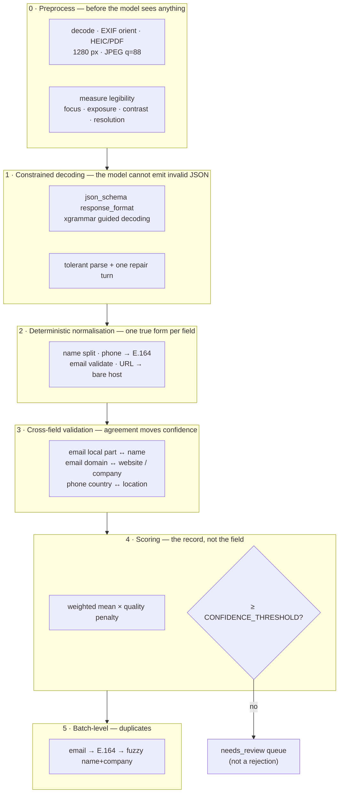

# 03 — The extraction pipeline

> If you read one document in this repository, make it this one.

## The thesis

**A vision-language model is an excellent reader and a poor validator.**

It will read `+44 7700 900461` off a blurred card correctly. It will also, on that same
blurred card, report `0.94` confidence in a company name it invented. Those two facts are not
in tension: the model is answering "what does this text say", and it has no mechanism for
answering "should you believe me". Its per-field confidence is a *reading* certainty, scored
on each field in isolation, and it is systematically overconfident precisely when the image is
worst.

So LeadForge asks the model for exactly one thing — transcribe what is printed, under a schema
it cannot violate — and then every judgement about whether a value is *trustworthy* is made by
deterministic code that can be tested, versioned and reasoned about. That code has five
layers, and each exists because the layer above it cannot do that job.



---

## Layer 0 — measure legibility before the model sees anything

`app/extract/preprocess.py`

Quality is measured on **the exact downscaled image the model will read**, not on the 12 MP
original, because "is this legible?" is a question about what the model gets. Four independent
metrics produce four flags: `low_resolution`, `blurry`, `dark`, `low_contrast`.

Two of those measurements are not the textbook ones, for the same underlying reason: **a
business card is mostly blank paper.**

**Focus.** The standard focus measure is variance of the Laplacian, which averages
high-frequency energy over the whole frame. On a card that means a crisp minimalist layout —
six words on white — scores *worse* than a genuinely blurred, densely printed one. So focus
here is the **peak** high-frequency response (the 99.9th percentile of a
difference-of-Gaussian), expressed as a percentage of the card's own ink-to-paper contrast:

```python
high_frequency = ImageChops.difference(gray, gray.filter(GaussianBlur(2.0)))
score = 100.0 * percentile(high_frequency.histogram(), 0.999) / contrast
```

Dividing by contrast makes the measure independent of exposure, and taking the peak makes it
independent of how much of the frame carries text. A sharp edge always produces a response
that is a fixed fraction of its own amplitude; blur destroys it. Calibration values from the
reference set: in focus **38–59**, 1.5 px Gaussian blur **13–23**, 3 px blur **8–9** — the
floor sits at **30**.

**Contrast.** Percentile-based contrast on a card is dominated by the background. Instead:
the extrema of a *median-filtered* copy, which measures ink-to-paper separation directly and
does not care what fraction of the frame the text occupies. The median filter is what stops a
single hot pixel from claiming the card has full contrast. Reference values: normal exposure
**230+**, dark card **51**, washed out **46** — the floor sits at **90**.

The metrics are deliberately independent, so an under-exposed but sharp photo is flagged
`dark` and **not** also `blurry`. Flags that overlap would compound their penalties and
double-punish one defect.

**Normalisation is deliberately light** — autocontrast and a modest brightness/sharpness lift,
only when a flag fires. The aggressive binarisation classical OCR wants actively *hurts* a VLM,
which is trained on natural photographs. Resisting the urge to "clean up" the image is a
decision, not an omission.

---

## Layer 1 — the model cannot emit invalid JSON

`app/vlm/prompt.py`, `app/vlm/client.py`, `app/vlm/parse.py`

Every call passes `response_format={"type": "json_schema", …, "strict": true}`. vLLM's
xgrammar backend constrains decoding to tokens that keep the output a valid instance of the
schema. This is not "ask nicely for JSON and hope" — **invalid output is not in the sampling
distribution.** See [ADR-0003](adr/ADR-0003-schema-constrained-decoding.md).

The schema asks for a faithful `raw_text` transcription plus, for each of the eight fields, a
`{"value": string|null, "confidence": 0..1}` pair, with `additionalProperties: false`
everywhere. The per-field object is **inlined eight times rather than referenced with
`$ref`** — guided-decoding backends have uneven `$ref` support, and a few hundred extra bytes
on the wire is a cheap price for a schema that compiles everywhere.

Nullability is load-bearing. `{"type": ["string", "null"]}` means the model can return a real
`null` rather than the string `"null"` or an invented value. On a card that prints only a name
and an email, six of the eight fields *must* come back null — a model that invents a company
there is worse than one that returns nothing.

Two fallbacks cover servers that ignore the parameter:

1. **Tolerant parse** — strip code fences, then find the outermost balanced `{…}` while
   correctly ignoring braces inside JSON strings.
2. **One repair turn** — hand the model its own bad output back with an instruction to emit
   only the object. Cheaper and far more reliable than a blind resample, because the model can
   see what it got wrong.

The prompt is worth reading in full (`app/vlm/prompt.py`). Its non-obvious instructions all
come from observed failures: *given name only, without titles*; *family name including
particles and generational suffixes, but not qualifications* (`Dear Ms. Raghavan PhD` is how
you lose a deal); *city, region and country — omit street, suite and postcode*; *prefer a
mobile or direct line over a switchboard or fax*; and **never copy a value from another
field**, because a model that fills `job_title` with the company name is guessing.

That location instruction is itself a fix. The first version asked for "the fullest address
line available", and the model faithfully obliged with street, suite and postcode — wrong on
4 of 5 cards against ground truth. Naming the parts to *omit* fixed it live:
`41 Harborline Street, Suite 900, Boston, MA 02220, USA` became `Boston, MA 02220, USA`.

---

## Layer 2 — deterministic normalisation

`app/extract/normalise.py`

The model returns what is *printed*. A CRM needs one canonical form. This layer is pure
functions over strings, which is why it is the most heavily tested part of the codebase.

**Names** — `split_name` handles, in order: a surname-first comma form (`Raghavan, Priya`,
distinguished from `Raghavan, Jr.` by checking whether the trailing token is a suffix);
leading titles (`Dr`, `Prof`, `Ir`, `Shri`, `Herr`, …); trailing post-nominals stripped
(`PhD`, `MBA`, `CFA`, `RIBA`, …); trailing generational suffixes **kept** (`Jr`, `III` —
they disambiguate father from son); and particles (`van`, `von`, `de la`, `bin`, `ibn`,
`Mac`, …), where the surname begins at the *first* particle so `de la Cruz` stays intact.
All-caps names are smart-cased, with `McDonald` and `MacLeod` special-cased and both
apostrophe glyphs handled, because real cards use both.

**Phones** — strip the `Tel:` / `Mob.` / `Direct —` label; when several numbers are printed
on one line (`+44 161 496 0118 / +44 7700 900 461`), take the first; convert a leading `00` to
`+`; then parse with `phonenumbers` against an ordered list of region hints — the number's own
country code first, then the region inferred **from the card's own address**, then a
library-wide guess. `DEFAULT_PHONE_REGION` is the last resort, not the first. Both forms are
kept: `phone` exactly as a human would read it off the card, `phone_e164` for the CRM.

**Emails** — label stripped, whitespace around `@` removed, lower-cased, validated with
`email-validator`. Repair is where the interesting decision is, below.

**Websites** — reduced to a bare registrable host: `https://www.Northwind.io/` →
`northwind.io`. If the result does not look like a host, the original string is kept rather
than a mangled one.

**Locations** — an `Address:` label stripped, whitespace collapsed; and a curated
country/city → ISO-3166 table used to infer a region for phone parsing and for the phone/location
cross-check. It is a table, not a gazetteer, and that is a named limitation.

### The repair rule: corroborated, never speculative

`@gmall.com` is *syntactically perfect*. Validity alone therefore cannot decide whether to
correct it, and a repair that quietly turns a wrong-but-visible value into a
plausible-but-wrong one is worse than no repair at all: the reviewer can fix a flagged bad
address, but will never notice a confidently wrong one.

So a repaired address is accepted **only when a second, independent piece of the card agrees**:

- the corrected domain equals the printed website, **or**
- the corrected domain's registrable part appears in the company name, **or**
- it is a ubiquitous consumer domain (nobody's card says `@gmall.com` on purpose).

And an address that *already parses* is overruled only by a documented misspelling or an exact
website match — never by a speculative character swap (`rn`→`m`, `0`→`o`, `1`→`l`). Anything
left unrepaired keeps its original text and loses confidence.

The same corroboration logic runs in the other direction. One real card prints its URL in
caps; the model returned `HELIIXMERIDIAN.EXAMPLE` while reading
`m.kowalczyk-reyes@helixmeridian.example` correctly. `repair_website_from_email` corrects the
host from the *validated* email domain when the two differ by a Levenshtein distance of 1 or 2
— tight on purpose, because companies genuinely do use different domains for web and mail —
and floors that field's confidence to 0.80 so the repair is visible rather than silent.

---

## Layer 3 — cross-field validation moves confidence

`app/extract/confidence.py`

This is the layer that does not exist in a "just call the model" pipeline, and it is the one
that makes the confidence number mean something.

A business card prints the same facts more than once. The name appears in the name line *and*
in the email local part. The company appears as a name *and* as a domain in both the email and
the URL. The country appears as an address *and* as a phone country code. **Two independent
readings of the same underlying fact agreeing is real evidence** — far stronger than either
reading's own certainty — and disagreeing is a real warning.

| Signal | Effect | Why |
|---|---|---|
| Email local part matches the name (`priya.raghavan@`, or `praghavan@`) | `first_name` **+0.05**, `last_name` **+0.05**, `email` **+0.05** | The single strongest corroboration on a card: two independent readings of the same string. |
| Email domain **equals** the printed website | `company` **+0.06**, `website` **+0.06**, `email` **+0.04** | The domain was read twice, in two typefaces, in two places. |
| Email domain's registrable part appears in the company name | `company` **+0.05**, `email` **+0.03** | Weaker but real; used only when there is no website to match. |
| Phone country ≠ country inferred from the address | `phone` **×0.8**, `location` **×0.8**, flag `phone_location_mismatch` | One of the two was misread. Which one is unknown, so both are discounted. |
| `job_title` identical to `company` | `job_title` capped at **0.4**, `company` at **0.6** | A model copying one field into another is guessing, not reading. |
| `first_name` identical to `last_name` | both capped at **0.5** | Same failure mode. |
| Email fails validation | `email` capped at **0.30**, flag `invalid_email` | Kept verbatim so a human sees it. |
| Phone unparseable to E.164 | `phone` capped at **0.35**, flag `unparseable_phone` | Same. |
| Website repaired from the email domain | `website` capped at **0.80** | A repair is not as good as a clean read. |

Two properties of this table are deliberate:

**Validation failure floors confidence; it never deletes the value.** An unparseable phone
stays on the record, exactly as printed, at a capped score. Deleting it would destroy the only
copy of information a human could have salvaged in two seconds.

**Bumps are capped at 0.99 and are only applied to fields that were actually extracted.** A
corroboration signal cannot manufacture confidence in a field that is null.

The three agreement flags (`name_email_match`, `domain_website_match`, `domain_company_match`)
are recorded but deliberately **kept out of the reviewer-facing `quality_flags` list**: they
explain a confidence bump, they are not a problem with the card. Flags a human sees should all
be actionable.

---

## Layer 4 — score the record, then queue it rather than judge it

`overall_confidence` is a **weighted mean over the fields that were actually populated**,
multiplied by a quality penalty:

```
overall = ( Σ weight[f] × score[f]  /  Σ weight[f] where score[f] > 0 )  ×  quality_multiplier
```

The weights encode what a salesperson needs in order to act on a lead, not what is hardest to
read:

| email | company | first_name | last_name | phone | job_title | location | website |
|---|---|---|---|---|---|---|---|
| 0.25 | 0.20 | 0.15 | 0.15 | 0.15 | 0.05 | 0.025 | 0.025 |

Normalising by the weight of *populated* fields matters: a minimalist card that legitimately
prints only a name and an email should be able to score 0.97, not be punished for the six
fields it does not have. Missing-field flags (`no_email`, `no_phone`, …) apply a small penalty
separately, so a card with no email is *slightly* less useful without being called
low-quality.

Quality penalties are multiplicative — `blurry` ×0.90, `low_resolution` ×0.94, `dark` ×0.96,
`invalid_email` ×0.92, and so on — with an **aggregate floor of 0.55**, so a pile of soft flags
can never bury an otherwise crisp read.

Then:

```python
status = "completed" if overall >= CONFIDENCE_THRESHOLD else "needs_review"
```

### Why `needs_review` instead of accept/reject

A hard threshold forces a bad choice on every uncertain card: ship it silently into the CRM, or
throw away a lead the user paid for. Both are wrong. A review queue is the third option, and it
is a *product feature* rather than an error path:

- Nothing is ever discarded. Every card that was read appears in the UI and in the export.
- The reviewer sees exactly which fields are weak and why (the flags), next to the original
  image, and fixes them in seconds.
- **The threshold becomes a business dial, not a correctness boundary.** Raise
  `CONFIDENCE_THRESHOLD` and more cards get human eyes; lower it and fewer do. Neither setting
  can make the system lose data.
- A human edit is treated as ground truth: `PATCH /leads/{id}` pins each edited field to
  confidence 1.0, re-scores the record, and flips it out of the queue if it now clears the
  threshold.

Rationale in full: [ADR-0004](adr/ADR-0004-deterministic-post-processing-and-review-queue.md).

---

## Layer 5 — duplicates, across the batch

`app/extract/dedup.py`

Three matchers, cheapest and most certain first:

1. **Normalised email** — exact match wins immediately.
2. **`phone_e164`** — exact match.
3. **Fuzzy identity** — `rapidfuzz.fuzz.token_set_ratio` over `first + last + company`, ASCII-folded
   and lower-cased, at or above `DUPLICATE_FUZZY_THRESHOLD` (90). Token-*set* ratio is the right
   variant here: it is insensitive to word order and to one side carrying an extra token, which
   is exactly how a middle name or a legal suffix shows up.

`duplicate_of` points at the **first-seen** card, and chains are collapsed to a single anchor,
so a group of three photos of the same card all reference one id rather than forming a linked
list.

**Nothing is ever dropped.** Two photos of the same card is a scanning artefact; two cards for
the same person from different offices is a real signal a reviewer wants to see. The UI tints
duplicates and the export can filter them (`?include_duplicates=false`) — the decision belongs
downstream, not here.

Guards: the fuzzy matcher requires a company and an identity key of at least six characters, so
two cards that both extracted only a first name cannot pair up.

---

## A worked example

The corpus contains `card_14`, a deliberately blurred, warped re-capture of `card_02`. Running
the four-card batch used throughout this documentation:

```
card_01_left_align_clean.png      completed      conf 0.97
card_02_centered_serif_clean.png  completed      conf 0.96
card_14_dup_of_02_blur.jpg        needs_review   conf 0.41   flags: blurry
card_08_no_email_clean.png        completed      conf 0.97
```

`card_08` prints no email at all and still scores 0.97, because the weighted mean is
normalised over the fields it *does* have. `card_14` is flagged `blurry` and queued. Correcting
its name through the API:

```bash
curl -X PATCH .../api/v1/leads/$CARD_ID -H 'content-type: application/json' \
  -d '{"first_name":"Marta","last_name":"Kowalczyk-Reyes"}'
```

```jsonc
{ "first_name": "Marta", "last_name": "Kowalczyk-Reyes",
  "overall_confidence": 0.5506, "edited": true,
  "status": "needs_review", "quality_flags": ["blurry"] }
```

The two corrected fields are now 1.0, the record climbs from 0.41 to 0.55 — and it correctly
**stays** in the review queue, because the rest of the card is still a blurred read. That is the
system behaving as designed: a human fixing two fields does not launder the rest of the record.

---

## Where this layering still fails

Honesty belongs in the same document as the design. Two failures are structural rather than
incidental, and both are expanded in [07 — limitations](07-limitations.md):

- **A confidently misread card can beat the threshold.** One degraded duplicate in the corpus
  scored **0.88** while hallucinating company, phone and domain. The quality flags discounted
  it multiplicatively, but a flat per-flag factor cannot express *how* degraded an image is, and
  the model's own per-field scores stayed high because it was confidently misreading. Weighting
  the penalty by the measured severity of the degradation — the focus score is already a
  continuous number — is the obvious fix and is not implemented. This is the single weakest part
  of the design.
- **Family-name-first ordering is mis-split.** `Tan Wei Ming` becomes first name `Tan Wei Ming`
  and last name `Ming`. The evidence to fix it is already on the card and already parsed:
  `weiming.tan@` in the email local part. Layer 3 is precisely where that signal belongs — it
  already compares the local part against the name — and it does not yet use it to *reorder*.

## Tuning knobs

| Variable | Default | Effect |
|---|---|---|
| `CONFIDENCE_THRESHOLD` | `0.65` | Review-queue boundary. A business dial. |
| `DUPLICATE_FUZZY_THRESHOLD` | `90` | Lower catches more duplicates and more false pairs. |
| `DEFAULT_PHONE_REGION` | `US` | Last-resort region when the card gives no hint. |
| `VLM_TEMPERATURE` | `0.0` | Transcription is not a creative task. |
| `VLM_MAX_TOKENS` | `1024` | Enough for `raw_text` plus eight fields; ~199 are typically used. |

Everything in this document is covered by tests: table-driven cases for every normaliser, the
cross-validation rules asserted individually, duplicate detection including chain collapsing,
and the scoring arithmetic. `make test` — 188 of them, all offline.
