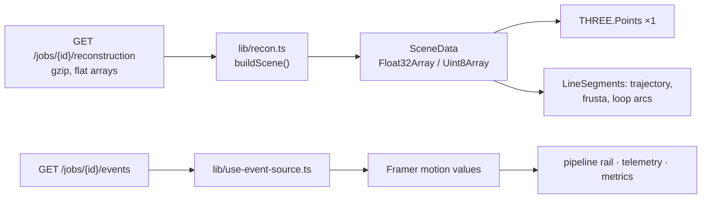

# 05 — Frontend

Next.js 15 App Router, TypeScript `strict`, Tailwind v4, Framer Motion 11,
`@react-three/fiber` + `drei` over three.js. `output: 'standalone'`, served on `:3000` as
uid 10001 from a distroless-ish Alpine runtime.

Two routes:

| route | what it is |
|---|---|
| `/` | hero, sample picker, upload dropzone |
| `/j/[jobId]` | the live run and then the results — one page, three states |

Reference material for the tier itself is in
[`../frontend/README.md`](../frontend/README.md); this document is about *why* it is shaped
the way it is.

---

## The constraint that shapes everything

A reconstruction streams progress at 60–110 frames per second and then hands over a cloud of
up to 60 000 points that the user immediately orbits and scrubs at 60 fps. Both of those are
continuous-value problems, and React is the wrong tool for continuous values.

So there are two hard rules, and everything else follows from them:

**1. The render loop never re-renders React.** All playback state — playhead position, play/
pause, follow-camera, speed, pending camera moves — lives in one plain mutable object
(`components/viewer/state.ts::ViewerRuntime`). `useFrame` reads it; the overlay writes it;
the handful of numbers a human needs to see (time, frame index, fps) are written **straight
into DOM nodes** whose refs are stashed on that same object:

```ts
export interface ViewerRuntime {
  frame: number;          // playhead, fractional frame index
  playing: boolean;
  follow: boolean;
  /** DOM nodes written directly from the render loop. */
  scrubberEl: HTMLInputElement | null;
  timeEl: HTMLElement | null;
  frameEl: HTMLElement | null;
  fpsEl: HTMLElement | null;
  /** r3f's `invalidate`, published by the driver so overlay controls can request a frame. */
  invalidate: (() => void) | null;
}
```

Routing that through `useState` would re-render the whole panel tree 60 times a second.

**2. `frameloop="demand"`.** A still scene costs nothing — no GPU work, no battery. Anything
that changes the scene calls `invalidate()`. This is also what makes the viewer usable on a
phone.

The same discipline applies to SSE: progress values drive Framer `useSpring` motion values,
not component state, so a 150 ms progress event animates a number without re-rendering the
tree that contains it.

---

## Data path



`lib/recon.ts` is the only place the contract's JSON is touched, and it runs **once** per job:

> Nothing here ever allocates a per-point JavaScript object: a 60 000-point payload becomes
> four typed arrays and is handed straight to a single `THREE.Points`.

That is the consumer half of
[ADR-0007](adr/ADR-0007-flat-typed-arrays-over-object-per-point-json.md). A 60 000-point
object-per-point payload would be ~60 000 short-lived JS objects to parse and then discard;
flat arrays are a `Float32Array` view and a `bufferGeometry` attribute.

### The basis change, done once

The API reports an OpenCV world: **X right, Y down, Z forward**. three.js wants Y up. So
every position is mapped `(x, y, z) → (x, −y, −z)` and every quaternion is pre-multiplied by
a 180° rotation about X. It is a pure change of basis — no data is altered — and it happens
in exactly one function. Every component downstream is in three.js coordinates and never has
to think about it.

Getting this wrong is the "why is my camera upside down and mirrored" bug, and the reason it
is worth a paragraph is that a *mirror* (odd determinant) is easy to introduce here and looks
almost right.

### Colour modes are precomputed buffers

Three attribute buffers are built up front — source RGB, a height ramp, viridis by
observation count — and switching mode swaps the attribute. No per-frame colour computation,
no re-upload.

### The density slider

Point order is **shuffled once** with a seeded shuffle when the scene is built, so thinning
the cloud is `setDrawRange(0, n)`. Without the shuffle, drawing the first *n* points would lop
off whole spatial regions — the map is written roughly in trajectory order, so "the first
40 %" means "the first 40 % of the trajectory".

---

## The viewer

One `THREE.Points` for the whole cloud, one `LineSegments` for every keyframe frustum, one
line for the trajectory, one per loop-closure arc. Draw-call count is constant in point count.

Points are rendered with a small custom shader rather than `PointsMaterial`, for two reasons
that are both visible in the output:

```glsl
// Capped: inside the cloud in follow-cam, uncapped attenuation turns nearby points into
// screen-filling blobs.
gl_PointSize = clamp(uSize * uScale / dist, 1.2, 14.0);
// Depth cue: far points recede instead of fighting the near ones for attention.
vFade = clamp(1.0 - (dist - uNear) / (uFar - uNear), 0.34, 1.0);
```

Size attenuation has to be **capped** because the follow camera flies *through* the cloud, and
the distance fade is what makes a sparse cloud read as 3D at all on a flat screen.

### Measured performance

From `make bench` in the frontend, replaying the trajectory — the worst case, because the
demand loop is saturated and the playhead camera moves every frame:

| renderer | 50 000 points | 60 000 points (the contract's cap) |
|---|---|---|
| Apple M4, ANGLE Metal, **vsync on** | **85 fps**, pinned to the display refresh | 85 fps |
| Apple M4, ANGLE Metal, vsync off | **607 fps** median — **1.65 ms/frame** | 589 fps — 1.70 ms/frame |
| SwiftShader, headless CI | 8 fps | — |

The vsync-on row is the honest user-facing figure: the viewer never misses a frame on this
display. The vsync-off row is the headroom behind it — 1.65 ms against a 16.7 ms budget at
60 Hz is roughly **10×**. The SwiftShader row is what the headless test harness sees; it is a
correctness check (a blank canvas would fail the smoke test), not a performance claim, and it
is listed so nobody mistakes it for one.

`make bench` records the renderer string alongside the number, so a frame rate is never
quoted without saying what drew it.

Bundle: **177 kB** first load on `/j/[jobId]`, of which three.js is code-split and fetched
*while the job is still reconstructing* rather than blocking first paint. The user is looking
at a progress rail for several seconds; that is free download time.

---

## The SSE hook

One hook for the whole app, `lib/use-event-source.ts`:

> exponential backoff on reconnect, and after three consecutive failures it gives up on the
> stream and falls back to polling the job snapshot. In mock mode the same code path drives a
> `MockEventSource`, so there is no mock-only branch in any component.

That last clause matters more than it reads. The mock is not a parallel implementation with
its own bugs — it is the same hook, the same handlers, the same components, fed by a
different `EventSourceLike`. `NEXT_PUBLIC_MOCK=1` runs the entire product, including the 3D
viewer and the exports, with **no API container at all**.

The stream is closed and never reopened once the job is terminal (`enabled: false`), so a
finished job page holds no connection.

SSE rather than WebSockets because the stream is strictly one-directional — the client never
sends anything after the initial request. A WebSocket would add a protocol upgrade, a
heartbeat to write, and reconnection logic the browser gives away for free with
`EventSource`.

---

## Three states, all designed

| state | what the user sees |
|---|---|
| **Queued** | position in the queue, stated as a number. `SLAM_MAX_CONCURRENT_JOBS=1` means waiting is normal, and "queued, 1 ahead of you" is very different from a spinner that looks stuck |
| **Running** | pipeline rail (Decode → Track → Optimise → Explore) with a travelling shimmer on the active segment; live telemetry — fps, keyframes, map points, closures — as counting numbers; a sparkline of throughput |
| **Completed** | the viewer, the metrics panel, the exports |
| **Failed** | the contract's `code` mapped to human copy, plus what to try instead |

Loop closures are announced *as they happen*, and the viewer flashes the new arc. That is the
one moment where the drift work becomes visible to a non-specialist, so it gets the
`--ease-spring` treatment rather than a log line.

---

## Design system and motion

Shared with Assignment 1 so the two submissions read as one body of work:
[`../../_contracts/design-system.md`](../../_contracts/design-system.md). Driftless takes the
cyan → violet accent ramp; Assignment 1 takes amber → magenta.

The motion rules that are actually enforced here:

- Durations: micro 120 ms, standard 260 ms, route 420 ms. `--ease-out-expo` for entrances,
  **linear for progress** (an eased progress bar lies about rate), `--ease-spring` only for
  success moments.
- `<MotionConfig reducedMotion="user">` wraps the app. Under `prefers-reduced-motion` every
  transform collapses to an opacity fade, and the viewer's fly-in is skipped entirely
  (`useReducedMotion()` is read in `viewer.tsx`).
- **Every number in the UI is tabular-nums monospace**, so a counting value does not jitter
  its own layout.
- The aurora field behind the page is one `<div>` with CSS radial gradients and keyframes —
  no canvas, no per-frame JS — and it shifts hue with job state (idle → processing → done).

---

## Accessibility

The 3D canvas is the obvious failure point, so it has a real text alternative rather than an
`aria-label` fig leaf:

```tsx
<div role="region"
     aria-label="3D reconstruction viewer. Use the accessible trajectory table below for a text alternative.">
```

`components/accessible-table.tsx` renders the trajectory as an actual table — frame, time,
position, tracked points, reprojection error — navigable by keyboard and readable by a screen
reader. The numbers a sighted user gets from the viewer are all present in it.

Beyond that: full keyboard navigation with a visible 2 px `focus-visible` ring, contrast
≥ 4.5:1 for body text on every surface token, and designed empty/loading/error states rather
than bare spinners.

**Dark mode only.** It is a deliberate product decision — this is a tool for staring at a 3D
scene — and it is stated rather than assumed.

---

## Up to scale, said three times

Monocular SLAM has no metric scale, and a UI that renders a trajectory in a 3D viewer invites
the reader to assume metres. So the disclaimer appears in three places: on the landing page,
in the metrics panel next to `trajectory_length`, and under the viewer. **Nothing in the UI is
labelled in metres.**

---

## Testing

```bash
make -C frontend test    # Playwright, desktop + phone projects
```

`e2e/smoke.spec.ts` drives a full mock reconstruction end to end: it waits for the loop
closure to be announced, **proves the canvas actually rendered geometry** (a blank canvas is
the failure mode that matters, so the assertion is on rendered pixels, not on the element
existing), toggles the cloud off and checks the frame changed, exercises the colour modes,
the scrubber and the follow camera, and reads the benchmark numbers back out of the metrics
panel.

A second project runs the same app at 390 × 844 and drives the viewer with **real touch
events through CDP**, because a synthesised mouse drag would pass even if touch orbit were
broken.

Headless Chromium has no GPU, so the harness forces ANGLE + SwiftShader. Without those flags
the canvas is a black rectangle and every viewer assertion passes for the wrong reason.

The harness builds and serves the **standalone** output rather than running `next dev`, so the
suite exercises the same server the container does. `E2E_BASE_URL=https://…` points it at a
running deployment instead; `E2E_GPU=1` runs headed on the host GPU.

---

## Known frontend limitations

Full list in [07 — Limitations](07-limitations.md); the ones that are purely this tier:

- **No server-side data fetching.** The API base is relative and same-origin behind the proxy,
  so there is no server origin for a server component to fetch from. The job page is a client
  component driven by SSE. This is a consequence of the deployment shape, not an oversight.
- **Run history is per tab.** The loop-closure A/B comparison remembers which runs had
  correction enabled in `sessionStorage`, because the contract's `Job` deliberately does not
  echo back the options a run was started with.
- **The cloud is capped at 60 000 points** by the API's web budget. The full cloud is always
  available through the PLY export.
- **No WebGPU path.** WebGL2 only. At 1.65 ms/frame there is no reason to add one.
