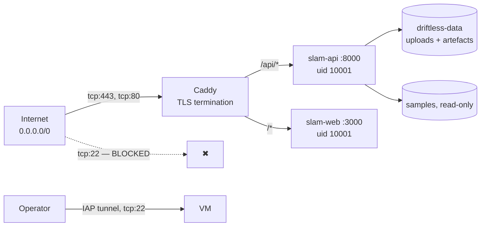

# 08 — Security and cost

What a public demo with no authentication actually exposes, what bounds it, and what it costs
to run.

The honest headline first: **this is a demo, not a production service.** There is no
authentication and no rate limiting. That is named as a limitation in
[07 §12](07-limitations.md#12-no-authentication-and-no-rate-limiting-on-the-public-demo), and
this document is about what follows from it.

---

## What is exposed



| surface | exposure |
|---|---|
| `tcp:443`, `tcp:80` from `0.0.0.0/0` | The application. Port 80 exists only for the ACME HTTP-01 challenge and the HTTP→HTTPS redirect |
| `tcp:22` | **Not reachable from the internet.** The firewall rule permits 22 only from `35.235.240.0/20`, Google's Identity-Aware Proxy range. Operator access is `gcloud compute ssh --tunnel-through-iap` and nothing else |
| Container ports `:8000`, `:3000` | Not published to the host in the deployment stack. They exist only on the `ak-project-net` bridge; Caddy is the sole ingress |
| Everything else | The VM sits in its own VPC, not the project `default` network — see below |

**The VPC choice is a real security decision, not boilerplate.** The project's `default`
network carries a blanket *allow-all-protocols from `0.0.0.0/0`* rule with no target tags. Any
VM placed there inherits it, which would expose SSH and every container port. Narrowing that
rule would break unrelated workloads, so the VM gets a dedicated VPC (`ak-project-vpc`) with
exactly two firewall rules.

---

## Threat model

### 1. Resource exhaustion — the main one

Anyone can `POST /api/v1/jobs` with a 200 MB video, or hit `POST /jobs/from-sample/{id}` in a
loop. There is no rate limiter.

What actually bounds it:

| bound | value | effect |
|---|---|---|
| `SLAM_MAX_CONCURRENT_JOBS` | 1 | An attacker gets a **queue**, not a fork bomb. CPU consumption is capped at one reconstruction regardless of request rate |
| `MAX_UPLOAD_MB` | 200 | Enforced while streaming, before the body is fully read |
| `MAX_VIDEO_DURATION_S` | 60 | Checked during the admission decode probe |
| `SLAM_MAX_FRAMES` | 1800 | Hard cap inside the engine; a longer clip is truncated and flagged, never processed in full |
| `JOB_TTL_HOURS` | 24 | The janitor deletes job directories on a timer |
| `deploy.resources.limits` | 6.00 CPU / 22 G | The `slam-api` container cannot starve Caddy or the web tiers |

The uncomfortable gap is **disk**. The janitor is time-based only, with no disk-pressure
trigger. Sustained 200 MB uploads inside a single 24 h window can fill the 100 GiB disk, and
nothing reacts until the clock does. Named in [07 §11](07-limitations.md#11-single-node-single-job-no-ha).

The second gap is that the queue itself is unbounded: an attacker can enqueue arbitrarily many
jobs, and although each is processed serially, each one's upload lands on disk immediately.

**What production would need**, in order: a per-IP token bucket at the Caddy layer, a
concurrent-jobs-per-client cap, a disk-watermark trigger in the janitor, and a bounded queue
that returns `429` when full.

### 2. Malicious input

Uploads are handed to FFmpeg via OpenCV's `VideoCapture`. That is a large C parser reachable
by an unauthenticated attacker, and it is the highest-severity surface here.

What reduces it:

- The container runs as **uid 10001**, non-root, with no `CAP_*` additions.
- The samples mount is **read-only** (`:ro`).
- Decoding happens in a **separate process** (the pool worker), so a crash kills a job, not the
  service — the store surfaces it as a failed job with an actionable error rather than a dead
  API. *(Verified accidentally during this work: running the service without the `slam`
  package installed produced `RuntimeError: SLAM engine unavailable: the slam package could
  not be imported … Set SLAM_BACKEND=stub` as a `job.failed` event, with the service still
  healthy.)*
- The content-type allowlist and the admission decode probe reject non-video before a job
  exists — and an undecodable upload **leaves nothing behind**: no job id, no directory, no
  artefact.

What does not reduce it: there is no seccomp profile, no gVisor, no user namespace remapping,
and no AppArmor confinement beyond Docker's default. A container escape through an FFmpeg
vulnerability is not defended against beyond running unprivileged.

### 3. Data exposure

Job ids are `uuid.uuid4().hex` — 122 bits of entropy — so they are effectively unguessable
capability tokens. But that is **entropy, not authorisation**: anyone holding the id gets the
video, the reconstruction, the point cloud and the trajectory. There is no ownership model.

Uploaded video is user content and may contain anything a camera can see: faces, interiors,
documents, screens. It is stored unencrypted at rest on the boot disk for up to 24 hours, and
there is **no way for a user to delete their own upload earlier** — no `DELETE /jobs/{id}`
exists.

For a public demo where the intended input is the three bundled sample clips, that is a
defensible scope. For anything else it is not, and it is called out rather than assumed away.

### 4. Transport and headers

TLS is Let's Encrypt via Caddy, automatic, with HTTP/3 enabled and an HTTP→HTTPS redirect.
Certificates live on a **bind mount**, so they survive container recreation and
`docker compose down -v` — which matters because Let's Encrypt rate-limits re-issuance.

`nip.io` is on the Public Suffix List, so `leads-…nip.io` and `slam-…nip.io` are treated as
separate registrable domains and each gets its own certificate and its own rate-limit budget.

`CORS_ORIGINS` defaults to `*`. On the deployment host both tiers are same-origin behind
Caddy, so this could and should be tightened to the single origin; it is left permissive so
that a reviewer can point a local frontend at the live API. With `*`, credentials are
explicitly **not** allowed (`allow_credentials` is set to `False` whenever the origin list
contains `*`), so the permissive setting cannot be combined with cookie-bearing requests.

### 5. Supply chain

| | |
|---|---|
| Runtime Python deps | **3**: `numpy`, `opencv-python-headless`, `scipy`. Plus FastAPI/uvicorn/pydantic for the service tier |
| Pretrained models | **None.** Nothing is downloaded at build or run time |
| Base images | `python:3.11-slim` and `node:22-alpine`, both digest-pinned by the builder |
| Direct deps | `~=` minor-pinned in `pyproject.toml`; the frontend has a committed `package-lock.json` |
| Network egress at runtime | **None.** The application makes no outbound request of any kind |

A three-dependency runtime with no model download is a deliberately small attack surface, and
it is the reason the image builds offline and starts in under a second.

### 6. Secrets

There are none. This application has no model endpoint, no third-party API, no database
credential and no API key. `.env.example` names variables and holds no values. `.gitignore`
covers `.env`, `.env.local`, `data/`, `*.mp4` (with the bundled samples explicitly
re-included), `node_modules`, `__pycache__` and `.next`.

That is worth stating plainly because "no secrets in the repo" is usually a claim that needs
auditing; here it is a structural property.

---

## What is deliberately *not* defended

Stated so the omissions are choices rather than oversights:

| | |
|---|---|
| Authentication | None. Adding a key would make the demo harder to review, which is its only purpose |
| Rate limiting | None beyond the one-job queue |
| Per-client quotas | None |
| Upload content inspection | Only "does one frame decode?" |
| CSRF | Not applicable — no cookies, no sessions, no state-changing GET |
| DDoS | Not defended. One VM, no CDN, no WAF |
| Audit logging | Structured JSON request logs with request IDs, to stdout. No retention, no shipping, no alerting |
| Secrets rotation | No secrets to rotate |

---

## Cost

On-demand list prices for `asia-south1` (Mumbai), pulled from the Cloud Billing Catalog API on
2026-09-14 — not from a pricing page. No committed-use or sustained-use discount assumed, so
these are upper bounds. Full breakdown: [`../../infra/COST.md`](../../infra/COST.md).

The VM hosts **both** assignments; these are the total figures, not Driftless's share.

| Resource | Spec | Hourly |
|---|---|---|
| vCPU | 8 × C3 core @ $0.036036 | $0.288288 |
| RAM | 32 GiB C3 @ $0.00409552 | $0.131057 |
| Boot disk | 100 GiB Balanced PD | $0.016438 |
| Static IP | attached to a running VM | $0.005000 |
| Ubuntu 24.04 LTS | standard, not Pro | $0.000000 |
| VPC, subnet, 2 firewall rules | — | $0.000000 |
| **Total, running** | | **$0.4408 / hr** |

- **$0.44 / hour**
- **$10.58 / day**
- **$321.77 / 30-day month (730 h)**

**Marginal cost per reconstruction: effectively zero.** There is no GPU, no per-token billing
and no third-party API. A 10 s clip occupies one core-set for ~5–9 s; at $0.4408/hr that is
about **$0.001**. The cost is the box being switched on, not the work it does — the exact
opposite of Assignment 1's shape, where the VM is cheap and the GPU dominates.

Egress is billed separately (~$0.12/GiB from Mumbai on Premium Tier) and is **not** in the
table above. It is negligible for demo traffic — a reconstruction payload is ~122 kB gzipped —
but a full-resolution PLY export would show up, so it is called out rather than silently
folded in.

### Stopping without destroying

Stopping the VM releases CPU and RAM but not storage, and an **unattached** static IP is billed
at a *higher* rate than an attached one ($0.012/hr vs $0.005/hr) — Google prices idle address
reservations deliberately.

| Resource | Hourly | Daily |
|---|---|---|
| 100 GiB Balanced PD | $0.016438 | $0.3945 |
| Static IP, reserved but unattached | $0.012000 | $0.2880 |
| **Total, stopped** | **$0.0284 / hr** | **$0.68 / day** |

~94 % saving while keeping the IP — and therefore the `nip.io` hostnames and the issued
certificates.

```bash
gcloud compute instances stop  ak-project-web --zone=asia-south1-b   # $0.68/day
gcloud compute instances start ak-project-web --zone=asia-south1-b   # comes back on its own
cd infra && ./teardown.sh --yes                                      # $0.00
```

The stack recovers unattended on start: `ak-project-stack.service` is enabled, and the Caddy
certificate store is a bind mount on the boot disk, so nothing is re-issued and no Let's
Encrypt rate limit is touched.

### AWS equivalent cost

`c7i.2xlarge` (8 vCPU / 16 GiB) in `ap-south-1` is roughly $0.38/hr on demand; `m7i.2xlarge`
(8 vCPU / 32 GiB, the like-for-like RAM match) is roughly $0.45/hr. Plus ~$0.08/GiB-month for
100 GiB `gp3` and ~$0.005/hr for an associated Elastic IP. **Within a few percent of the GCP
figure** — the provider choice is not a cost decision. Resource mapping:
[01 — Architecture](01-architecture.md#aws-equivalents).
